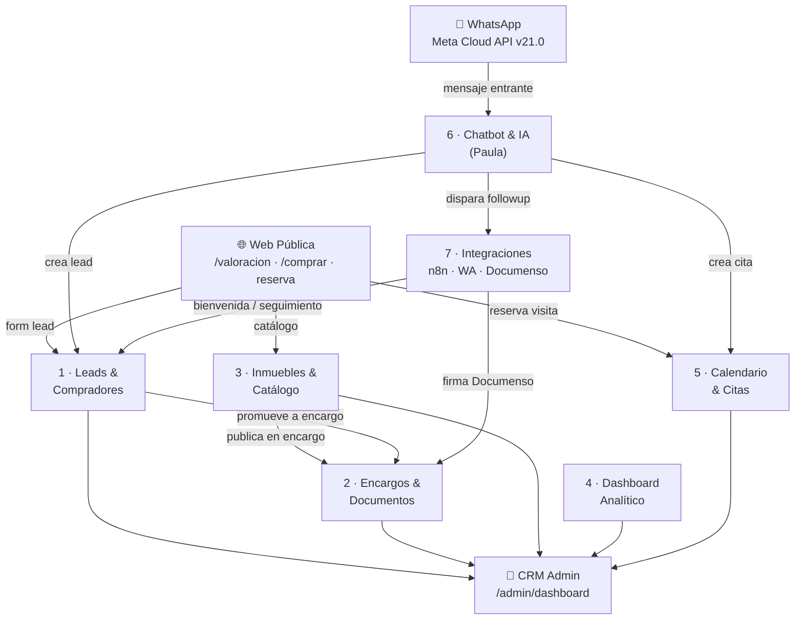
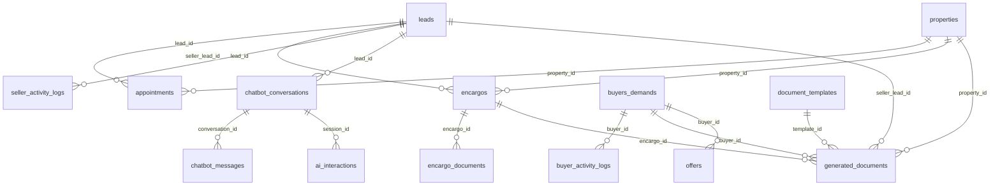

# Tu Asesor V2 — Guía Técnica del CRM

> **Propósito**: referencia para agentes IA que trabajen sobre este proyecto. Incluye mapa del sistema, fichas por área, matriz de dependencias, informe de calidad y reglas de oro.
>
> **Generado**: 2026-06-08 | Schema verificado vía Supabase MCP | `master` commit `07dbbef`

---

## 1. Mapa del sistema

### Visión general

Tu Asesor V2 es un CRM + web pública para un asesor inmobiliario independiente en Sevilla. Es una única aplicación Next.js 16.2.6 (App Router, TypeScript) desplegada en Netlify. El sitio público capta leads (vendedores, compradores, reservas de visita), publica un catálogo de inmuebles y tiene un chatbot WhatsApp/widget web. El admin `/admin/dashboard` es el CRM.

### Diagrama de áreas y flujos



### Diagrama ER simplificado (tablas clave)



> ⚠️ **Relación ausente crítica**: `buyers_demands` **no tiene FK a `leads`**. Son entidades paralelas vinculadas conceptualmente por phone/name. Ver Sección 6.

### Stack tecnológico

| Capa | Tecnología |
|---|---|
| Frontend/Backend | Next.js 16.2.6 App Router, TypeScript, Tailwind CSS |
| Base de datos | Supabase Postgres + RLS (ref `hmzqgtitlonaxbwlhcob`) |
| Hosting | Netlify (serverless functions + CDN) |
| Automatización | n8n Cloud (`alvaroolopez.app.n8n.cloud`) |
| WhatsApp | Meta Cloud API v21.0 (phone ID `1072204902649747`) |
| Firma digital | Documenso Cloud API **v1** (⚠️ no v2) |
| IA principal | Gemini Flash (`gemini-flash-latest`) + fallback keywords |
| IA secundaria | OpenAI / Anthropic (env-configurable) |

### Schema Supabase — inventario de tablas (verificado 2026-06-08)

| Tabla | Filas | RLS | Propósito |
|---|---|---|---|
| `properties` | 1 | ✅ | Inmuebles publicados |
| `leads` | 5 | ✅ | Contactos (buyer/seller) |
| `buyers_demands` | 2 | ✅ | Demandas de compra |
| `appointments` | 1 | ✅ | Citas y eventos de calendario |
| `encargos` | 1 | ✅ | Expedientes de venta en exclusiva |
| `encargo_documents` | 0 | ✅ | Anexos operativos del encargo |
| `generated_documents` | 1 | ✅ | Documentos generados/firmados |
| `document_templates` | 6 | ✅ | Plantillas legales |
| `chatbot_conversations` | 2 | ✅ | Sesiones del chatbot |
| `chatbot_messages` | 22 | ✅ | Mensajes individuales |
| `ai_interactions` | 0 | ✅ | Log de interacciones IA |
| `buyer_activity_logs` | 2 | ✅ | Historial actividad comprador |
| `seller_activity_logs` | 2 | ✅ | Historial actividad vendedor |
| `web_visits` | 40 | ✅ | Visitas web (analytics) |
| `n8n_webhook_logs` | 55 | ✅ | Log de llamadas n8n |
| `operating_expenses` | 3 | ✅ | Gastos operativos del negocio |
| `system_errors` | 5 | ✅ | Errores del sistema |
| `tool_calculations` | 0 | ✅ | Cálculos de valoración/plusvalía (escrita por /plusvalia y /rentabilidad) |
| `posts` | 13 | ✅ | Artículos del blog |
| `reviews` | 1 | ✅ | Reseñas de clientes |

**Tablas que NO existen** (mencionadas en comentarios/docs):
- `chatbot_followups` → el estado vive en `chatbot_conversations.metadata.followup_visit`
- `expenses` → el nombre real es `operating_expenses`
- `property_documents` y `offers` → **eliminadas el 2026-06-08** (Ola 2): eran legacy muertas (0 refs, 0 filas).

---

## 2. Fichas por área

### 2.1 Leads & Compradores

**Qué hace**: Gestiona el pipeline de contactos. `WarmLeadsManager` muestra leads activos (`status != 'closed'`) con drawer de detalle, timeline de actividad del vendedor y acciones CRM (promover a encargo, agendar hito). `BuyersManager` muestra compradores registrados en la pestaña "Pedidos" con sus demandas (presupuesto, zona, tipología). `BuyerRegistrationModal` es el formulario de alta de compradores (web pública y admin). `ZoneSelectorPremium` es el selector de zonas geográficas con mapa interactivo.

**Flujo de datos**:
- Web pública `/comprar` → `BuyerRegistrationModal` → INSERT `leads` (type='buyer') + UPSERT `buyers_demands` + disparo n8n `QikfXMJumWbpI3wL` (bienvenida HSM)
- Chatbot scheduling → INSERT `leads` + UPSERT `buyers_demands` + INSERT `appointments` durante entrevista
- Reserva web → `appointmentService.bookPublicAppointment` → INSERT `leads` + UPSERT `buyers_demands` + INSERT `appointments`

**Tablas leídas**: `leads`, `buyers_demands`, `buyer_activity_logs`, `seller_activity_logs`, `appointments`, `generated_documents`
**Tablas escritas**: `leads`, `buyers_demands`, `buyer_activity_logs`, `n8n_webhook_logs`
**Endpoints expuestos**: `POST /api/n8n/new-lead`
**Componentes**:
- `sections/WarmLeadsManager.tsx` — pipeline de vendedores/compradores activos
- `sections/BuyersManager.tsx` — tabla de compradores con demandas
- `sections/ZoneSelectorPremium.tsx` — selector de zonas con mapa
- `src/components/BuyerRegistrationModal.tsx` — formulario alta comprador
- `src/lib/leadSources.ts` — etiquetas canónicas de fuente
- `src/lib/phone.ts` — normalización E.164 (`normalizeEsPhone`)

**Zonas frágiles**:
- `buyers_demands` no tiene FK a `leads` — la pestaña "Pedidos" puede no mostrar compradores si solo existe su `leads` sin el `buyers_demands` correspondiente.
- WarmLeadsManager filtra `status != 'closed'` — leads promovidos a encargo (status='closed') desaparecen del módulo.
- ZoneSelectorPremium es el componente más grande del área; revisar si tiene dead code antes de modificar.

---

### 2.2 Encargos & Documentos

**Qué hace**: Gestiona el expediente jurídico/comercial completo de una venta en exclusiva. Un **Encargo** vincula: lead vendedor + Nota de Encargo firmada (vía Documenso) + inmueble publicado (opcional). `EncargosManager` tiene 4 tabs: Resumen, Documentos, Actividad (timeline mixto), Publicación web. `DocumentsManager` gestiona 6 plantillas de documentos legales con autorrelleno, generación de PDF y firma digital Documenso.

**Flujo de firma E2E**:
1. Admin selecciona plantilla en `DocumentsManager` + autorrellena campos
2. INSERT `generated_documents` (signature_status='draft') + preview PDF en iframe
3. "Enviar a firmar" → `POST /api/documents/send` → `buildSimplePdf` (pdf-lib) → Documenso API v1 (create → upload → fields → send)
4. Documenso llama `POST /api/webhooks/documenso` → UPDATE `signature_status`
5. Al completarse → WhatsApp aviso a Álvaro

**Tablas leídas**: `encargos`, `encargo_documents`, `generated_documents`, `document_templates`, `leads`, `properties`, `appointments`, `buyer_activity_logs`
**Tablas escritas**: `encargos`, `encargo_documents`, `generated_documents`
**Endpoints**: `GET/POST /api/encargos`, `GET/PATCH/DELETE /api/encargos/[id]`, `POST /api/documents/send`, `GET /api/documents/[id]/download`, `POST /api/webhooks/documenso`
**Storage**: `encargo-files` (privado, signed URLs)
**Componentes**: `EncargosManager.tsx`, `encargos/EncargoFormModal.tsx`, `DocumentsManager.tsx` (1604 LOC), `src/lib/documenso.ts`, `src/lib/brandedDoc.ts`, `src/lib/brandLogo.ts`

**Plantillas activas** (6 en `document_templates`):
| Categoría | Firmantes | Variante visual |
|---|---|---|
| Nota de Encargo | Vendedor(es) + Asesor | Corporate (logo, navy, dorado) |
| Propuesta de Compraventa | Vendedor + Comprador + Asesor | Corporate |
| Contrato Privado | Vendedor + Comprador + Asesor | Legal (serif, sin logo) |
| Ficha 218/2005 | Comprador | Corporate |
| KYC (Ley 10/2010) | Comprador | Corporate |
| Parte de Visita | Visitante | Corporate |

**Zonas frágiles**:
- Documenso **solo API v1** — la URL debe terminar en `/api/v1`. El switch de v2→v1 fue un fix histórico crítico.
- `encargos.nota_encargo_doc_id` es nullable — el drawer muestra el encargo sin nota firmada sin error.
- `generated_documents` tiene 4 FKs opcionales (`property_id`, `seller_lead_id`, `buyer_id`, `encargo_id`) — no todas se rellenan siempre; usar optional chaining en lecturas.
- `property_documents` (0 filas): tabla legacy, probablemente supersedida por `generated_documents` + `encargo_documents`. Verificar si hay código activo que la lea.
- `offers` (0 filas): tabla sin UI activa — posible código muerto.

---

### 2.3 Inmuebles & Catálogo

**Qué hace**: Gestiona el catálogo de inmuebles. `PropertiesManager` (101 LOC post-split, orquestador) permite CRUD de propiedades con fotos (bucket `properties`), slots de visita y publicación en web. El SmartMatchmakerModal lanza difusión inteligente a compradores coincidentes por GPS + presupuesto. La web pública `/comprar` muestra el catálogo con filtros. El endpoint `/api/properties/[id]/ai-report` genera análisis de mercado con Gemini Flash.

**Flujo matchmaking**: Admin activa difusión desde SmartMatchmakerModal → `POST /api/n8n/diffusion` (service-role, Haversine GPS matching en servidor) → n8n `Difusion Inteligente` → HSM `nueva_propiedad_match` (7 vars) por WhatsApp a compradores coincidentes.

**Tablas leídas**: `properties`, `leads`, `buyers_demands`, `web_visits`, `appointments`
**Tablas escritas**: `properties`, `n8n_webhook_logs`
**Endpoints**: `GET/POST /api/properties`, `GET/PATCH/DELETE /api/properties/[id]`, `POST /api/n8n/diffusion`, `POST /api/properties/[id]/ai-report`
**Storage**: `properties` (público, anon read)
**Componentes**: `PropertiesManager.tsx` (101 LOC), `properties/PropertyFormModal.tsx` (~667 LOC), `properties/SmartMatchmakerModal.tsx` (~351 LOC), `properties/PropertiesTable.tsx` (~177 LOC), `HeatmapManager.tsx` (11 LOC placeholder)

**Shape crítico del jsonb `features`** (columna flexible, siempre optional chaining):
```typescript
features: {
  // Chatbot scheduling:
  visitable_slots: Array<{date: "YYYY-MM-DD", slots: ["HH:MM"]}>,
  address: string,          // zona para respuestas del bot

  // Matchmaker & difusión:
  lat: number | string,     // ⚠️ puede venir como string del jsonb
  lng: number | string,
  floor: string,            // "3º", "Bajo", "Ático"
  elevator: boolean,

  // Catálogo web:
  sqm: number, rooms: number, bathrooms: number, type: string,

  // Encargos:
  is_encargo: boolean,

  // Financiero:
  precio_valoracion: number,
  agent_valuation: number,
}
```

**Zonas frágiles**:
- `lat`/`lng` pueden ser strings — aplicar `parseFloat()` antes de operaciones numéricas.
- `visitable_slots` debe seguir **exactamente** `[{date:"YYYY-MM-DD", slots:["HH:MM"]}]` — el chatbot falla silenciosamente si el shape difiere.
- `HeatmapManager.tsx` es un placeholder de 11 líneas — aparece en el menú pero no hace nada.
- GEMINI_API_KEY requerido para ai-report — sin ella devuelve 502 con mensaje claro.

---

### 2.4 Dashboard analítico

**Qué hace**: Panel de métricas en 3 tabs. **Operaciones** (pipeline de ventas, visitas por propiedad, estimación de bajada de precio, informe IA). **Finanzas** (ingresos, gastos operativos, KPIs financieros CAC/LTV, simulador de honorarios). **Marketing** (funnel web→lead→cita, canales de tráfico, métricas IA).

**Tablas leídas**: `properties`, `leads`, `buyers_demands`, `appointments`, `web_visits`, `operating_expenses`, `chatbot_conversations`
**Tablas escritas**: `operating_expenses` (auto-seed inicial en FinanzasTab), `web_visits` (vía `/api/analytics/track`)
**Endpoints**: `POST /api/analytics/track`
**Componentes**: `DashboardOverview.tsx`, `OperacionesTab.tsx` (164 LOC post-split), `FinanzasTab.tsx` (837 LOC), `MarketingTab.tsx` (553 LOC), `dashboard/operaciones/operacionesUtils.ts`, `AIReportModal.tsx`, `PipelineCard.tsx`, `GrowthChart.tsx`, `PropertyViewsRanking.tsx`, `BuyersBreakdown.tsx`

**Flujo de datos**: Cada tab carga datos al montarse via Supabase client. OperacionesTab usa `web_visits` para visitas reales + `properties.published_at` para días en mercado. FinanzasTab lee `operating_expenses` y si no hay registros inserta 3 baselines. MarketingTab construye funnel desde `web_visits, leads, appointments, chatbot_conversations`.

**Zonas frágiles**:
- `FinanzasTab.tsx:66-86`: auto-inserta gastos baseline (Autónomos €294, Idealista €120, Cloud €80) al montar si no existen. La deduplicación depende del check `hasAutonomos` — revisar con múltiples filas en `operating_expenses`.
- `MarketingTab.tsx:66`: `webVisitors = Math.max(leads.length + 5, uniqueWebVisitors)` — **infla visitantes en +5 artificialmente**.
- `MarketingTab.tsx:198`: tendencias "+14.2%" y "+8.7%" son **constantes hardcodeadas**, no calculadas.
- `ai_interactions` tiene 0 filas — `lead_id` es NOT NULL, el engine no puede insertar cuando el lead es desconocido. Tabla prácticamente inútil en su estado actual.
- `system_errors` tiene 5 filas — no hay UI admin para visualizarlas.
- `tool_calculations` tiene 0 filas — verificar si las herramientas públicas (valoración/plusvalía/rentabilidad) siguen escribiendo aquí.

---

### 2.5 Calendario & Citas

**Qué hace**: Vista de calendario semanal + lista de ruta para gestionar todas las citas del negocio: captaciones de exclusiva, visitas con compradores, cierres, tareas admin y tiempo bloqueado. Las citas creadas por el chatbot, desde la web pública, o manualmente desde el admin aparecen en la misma vista.

**Tablas leídas**: `appointments`, `leads`, `properties`
**Tablas escritas**: `appointments`
**Endpoints**: ninguno propio (lectura directa via Supabase client)
**Componentes**: `CalendarManager.tsx` (~200 LOC post-split), `calendar/AppointmentFormModal.tsx` (~483 LOC), `calendar/WeekGridView.tsx` (~297 LOC), `calendar/RouteListView.tsx` (~149 LOC), `calendar/calendarUtils.ts` (~131 LOC), `src/lib/appointmentService.ts`

**Tipos de cita** (CHECK constraint en DB):
| Tipo | Uso |
|---|---|
| `captacion` | Visita del asesor para captar exclusiva |
| `visita` | Visita de comprador a inmueble |
| `cierre` | Reunión de negociación/firma |
| `admin` | Tarea administrativa |
| `blocked` | Tiempo bloqueado (no disponible) |

**Flujo citas del chatbot**: scheduling.ts → `madridLocalToUtcIso(preferredDate)` → INSERT `appointments` (status='pending', type='visita', duration=30min) + UPSERT `buyers_demands`.

**Zonas frágiles**:
- `scheduled_at` es UTC en DB. La vista semanal debe convertir a `Europe/Madrid` — un error aquí mueve citas al día anterior/siguiente en el cambio de horario DST.
- Todas las citas nacen con `status='pending'` — no hay confirmación automática ni aviso al cliente cuando se confirman manualmente.
- `appointmentService.bookPublicAppointment` usa `madridLocalToUtcIso` — fuente canónica para conversión.
- Tipo 'llamada' mencionado como pendiente en SYNC_AI — requeriría migración del CHECK constraint.

---

### 2.6 Chatbot & IA (Paula)

**Qué hace**: Bot de WhatsApp y widget web que actúa como asistente inmobiliaria "Paula". Responde consultas sobre propiedades, agenda visitas verificando disponibilidad en `visitable_slots`, realiza entrevista de 3 preguntas a leads nuevos (ahorro/financiación/tipo de búsqueda), y escala al asesor cuando es necesario. Motor multi-proveedor: Gemini Flash → OpenAI → Anthropic → keywords.

**Flujo WhatsApp (happy path)**:
1. Meta → `POST /api/webhooks/whatsapp` con mensaje del cliente
2. Webhook recupera/crea `chatbot_conversations` (por `wa_phone_number`) y guarda `chatbot_messages`
3. Si hay `interview_state` activo → `scheduling.ts handleInterviewStep()`
4. Sino → `engine.ts processMessage()` (context: system prompt + últimos 10 mensajes + propiedades activas)
5. LLM devuelve JSON `{response, intent, should_escalate, preferred_date}`
6. Si `intent=schedule_visit` → `tryHandleScheduleVisit()` → verifica `visitable_slots` → crea `appointments` + UPSERT `buyers_demands`
7. Si `should_escalate=true` → WhatsApp aviso a Álvaro (throttle 15 min via `metadata.last_escalation_notify_at`)
8. Respuesta → Meta Graph API

**Tablas leídas**: `properties` (activas + visitable_slots), `leads`, `chatbot_conversations`, `chatbot_messages`, `buyers_demands`
**Tablas escritas**: `chatbot_conversations` (metadata), `chatbot_messages`, `leads`, `buyers_demands`, `appointments`
**Endpoints**: `POST /api/webhooks/whatsapp`, `POST /api/chatbot/message` (web widget), `POST /api/admin/chat/send`, `POST /api/webhooks/chatwoot`
**Componentes**: `ChatManager.tsx` (~504 LOC), `src/lib/chatbot/engine.ts`, `src/lib/chatbot/scheduling.ts`, `src/lib/chatbot/systemPrompt.md`, `src/lib/whatsapp.ts`

**Estado persistido en `chatbot_conversations.metadata`** (jsonb — toda la máquina de estados). ⚠️ Campos verificados contra `scheduling.ts` commit `1141148` (2026-06-08):
```json
{
  "interview_state": {
    "step": 1,
    "answers": { "savings": 0, "funding": "", "tipoCompra": "" },
    "attempts": 0,
    "target": {
      "propertyId": "uuid",
      "propertyTitle": "string",
      "propertyZone": "string|null",
      "scheduledAt": "ISO_UTC",
      "leadId": "uuid",
      "leadName": "string",
      "leadPhone": "+34..."
    },
    "startedAt": "ISO_UTC"
  },
  "scheduling": { "pending_day": "YYYY-MM-DD|null" },
  "followup_visit": { "pending_until": "ISO_UTC", "sent": false },
  "context_property_id": "uuid",
  "last_property_id": "uuid",
  "last_escalation_notify_at": "ISO_UTC",
  "escalated_at": "ISO_UTC"
}
```
> Nombres EXACTOS (no usar variantes). Escritos por `setConversationMetadata` / `setSchedulingHint` / `scheduleVisitFollowup` en `scheduling.ts`. Las claves `last_escalation_notify_at` y `escalated_at` las escribe el webhook de WhatsApp (escalación). NO existen `pending_visit_followup_until` ni `visit_followup_at` (eran imprecisión de una versión previa de esta guía).

**Deuda técnica conocida** (ya documentada — NO redescubrir como nuevo):

| ID | Descripción | Estado |
|---|---|---|
| `CHATBOT-PROMPT-INJECTION` | Historial completo + catálogo de propiedades inyectados en LLM sin sanitización — usuario malicioso puede manipular el bot via mensajes | Pendiente fix |
| `CHATBOT-LLM-OVERRIDE` | Gemini Flash puede ignorar la regla "no confirmar cita directamente" del system prompt | Mitigado: scheduling vive en código, no en LLM |
| `CHATBOT-FOLLOWUPS-MISSING` | Tabla `chatbot_followups` no existe; `get_pending_visit_followups` usa `metadata.followup_visit.{pending_until,sent}` | Workaround funcional |
| `CHATBOT-DST` | Edge cases en conversión hora Madrid → UTC en cambios de horario (mar/oct) | Documentado, pendiente fix robusto |

**Zonas frágiles adicionales**:
- `ai_interactions.lead_id` es NOT NULL — el engine no puede escribir en esta tabla cuando el lead es desconocido. Con 0 filas en producción, la tabla es efectivamente inútil.
- `ChatManager.tsx:312` construye `contactLabel` desde `wa_phone_number` o `metadata.visitor_name` — si ambos son null, el label es ambiguo.
- `get_pending_visit_followups` devuelve lista vacía (sin error) fuera de la ventana 10:00-21:00 Madrid — followups no procesados hasta el siguiente ciclo.

---

### 2.7 Integraciones & Datos

**Qué hace**: Puente entre el CRM y los sistemas externos. Gestiona webhooks entrantes (Meta WA, n8n, Documenso, Chatwoot), los formularios de captura de leads de la web pública, y el blog con generación automática IA. `WebhooksManager` muestra el log de llamadas n8n del CRM.

**n8n workflows activos (5)**:

| ID | Nombre | Trigger | Acción |
|---|---|---|---|
| `tFk38qR62f1yEnuz` | Generador Diario Blog | Cron 8AM diario | Gemini Flash → INSERT `posts` |
| `VnXhrEh2G8AeR0DT` | Seguimiento Leads Diario | Cron L-V 9AM | `GET /api/webhooks/n8n?action=get_pending_followups` → HSM `seguimiento_lead` |
| `QikfXMJumWbpI3wL` | Notificacion Nuevo Lead | Webhook `/webhook/new-lead` | HSM `bienvenida_nuevo_lead` (2 vars: nombre, zona) |
| `X2qbhCUWngf9qmJI` | Enviar Documento a Firmar | Webhook `/webhook/send-to-sign` | → `/api/documents/send` → aviso WA Álvaro |
| `6E0AP0gqLUliPQtN` | Difusion Inteligente | Webhook `/webhook/smart-diffusion` | → `/api/n8n/diffusion` → HSM `nueva_propiedad_match` (7 vars) |

**Acciones implementadas en `/api/webhooks/n8n`**:
- `get_pending_followups`: buyers inactivos ≥60 días, cooldown 90 días, cap 20/día
- `get_pending_visit_followups`: followup 3h post-link, solo 10:00-21:00 Madrid
- `create_lead`, `create_appointment`, `get_property_info`, `get_lead_info`, `log_interaction`, `track_visit`

**Formularios públicos y tablas destino**:
| URL | Escribe en |
|---|---|
| `/valoracion` | `leads` (type=seller, preferences={...}) |
| `/plusvalia` | `tool_calculations` (pendiente verificar) |
| `/rentabilidad` | `tool_calculations` (pendiente verificar) |
| `/contacto` | `leads` (type=buyer) |
| `/dejar-resena` | `reviews` |

**Tablas leídas**: `leads`, `n8n_webhook_logs`, `posts`, `reviews`
**Tablas escritas**: `leads`, `n8n_webhook_logs`, `web_visits`, `posts`, `reviews`, `appointments`, `ai_interactions`
**Componentes**: `WebhooksManager.tsx` (208 LOC, lectura paginada de `n8n_webhook_logs`), `BlogManager.tsx`, `ReviewsManager.tsx`

**Zonas frágiles**:
- Credencial Bearer n8n ID `s3YA5o57rEEdFw1W` (Meta WA token) — verificar que sigue atada en "Difusion Inteligente" (`6E0AP0gqLUliPQtN`) tras cualquier update del workflow (warning de 2026-06-03: "credentials skipped during auto-assignment").
- BlogManager y n8n Generador Diario insertan en la misma tabla `posts` — sin deduplicación de slugs si el mismo título se genera manualmente y vía n8n.
- `/dejar-resena` sin rate limiting visible — vulnerable a spam de reseñas.
- `DOCUMENSO_WEBHOOK_SECRET` debe estar configurado en Documenso Panel + Netlify env — sin él el webhook `/api/webhooks/documenso` no puede verificar la autenticidad.

---

## 3. Matriz componente ↔ tabla ↔ endpoint

| Componente / Ruta | Tablas leídas | Tablas escritas | Endpoints llamados | Endpoint propio |
|---|---|---|---|---|
| `WarmLeadsManager.tsx` | leads, appointments, generated_documents, seller_activity_logs | leads | — | — |
| `BuyersManager.tsx` | buyers_demands, buyer_activity_logs | buyers_demands | — | — |
| `ZoneSelectorPremium.tsx` | — (estado local) | — | — | — |
| `BuyerRegistrationModal.tsx` | — | leads, buyers_demands, n8n_webhook_logs | `/api/n8n/new-lead` | — |
| `BuyerMap.tsx` | buyers_demands, properties | — | — | — |
| `EncargosManager.tsx` | encargos, encargo_documents, generated_documents, appointments, buyer_activity_logs, leads | encargos, encargo_documents | `GET/POST /api/encargos`, `PATCH/DELETE /api/encargos/[id]` | — |
| `DocumentsManager.tsx` | generated_documents, document_templates, leads, buyers_demands, encargos | generated_documents | `POST /api/documents/send`, `GET /api/documents/[id]/download` | — |
| `PropertiesManager.tsx` | properties | properties | `GET/POST/PATCH/DELETE /api/properties`, `POST /api/n8n/diffusion`, `POST /api/properties/[id]/ai-report` | — |
| `HeatmapManager.tsx` | — | — | — | — |
| `DashboardOverview.tsx` | leads, appointments, properties | — | — | — |
| `OperacionesTab.tsx` | properties, leads, appointments, web_visits | — | — | — |
| `FinanzasTab.tsx` | properties, operating_expenses | operating_expenses (auto-seed) | — | — |
| `MarketingTab.tsx` | leads, appointments, web_visits, chatbot_conversations | — | — | — |
| `CalendarManager.tsx` | appointments, leads, properties | appointments | — | — |
| `ChatManager.tsx` | chatbot_conversations, chatbot_messages | chatbot_conversations, chatbot_messages | `POST /api/admin/chat/send` | — |
| `WebhooksManager.tsx` | n8n_webhook_logs | — | — | — |
| `BlogManager.tsx` | posts | posts | — | — |
| `ReviewsManager.tsx` | reviews | reviews | — | — |
| `/comprar/page.tsx` | properties (RLS anon) | buyers_demands, leads | — | — |
| `/valoracion/page.tsx` | — | leads | `/api/n8n/new-lead` | — |
| `/dejar-resena/page.tsx` | — | reviews | — | — |
| `POST /api/webhooks/whatsapp` | chatbot_conversations, chatbot_messages, leads, properties, buyers_demands | chatbot_conversations, chatbot_messages, leads, buyers_demands, appointments | Meta Graph API | ✅ |
| `POST /api/webhooks/n8n` | leads, appointments, chatbot_conversations | leads, appointments, ai_interactions, chatbot_messages, n8n_webhook_logs | — | ✅ |
| `POST /api/n8n/diffusion` | properties, buyers_demands | n8n_webhook_logs | n8n webhook smart-diffusion | ✅ |
| `POST /api/n8n/new-lead` | — | n8n_webhook_logs | n8n webhook new-lead | ✅ |
| `POST /api/analytics/track` | — | web_visits | — | ✅ |
| `POST /api/webhooks/documenso` | generated_documents | generated_documents | Meta WA API (aviso Álvaro) | ✅ |
| `GET /api/health` | — | — | — | ✅ |

---

## 4. Informe de calidad

### CRITICAL — Ninguno de rotura inmediata, pero leer la nota de seguridad

No hay hallazgos que rompan el sistema *hoy*. Pero la prioridad real de ejecución debe poner la **seguridad por delante de la cosmética**:

> 🔐 **`CHATBOT-PROMPT-INJECTION` es el riesgo más serio del sistema**, aunque esté listado abajo como "deuda conocida". El bot está expuesto a clientes reales por WhatsApp y el historial + catálogo se inyectan al LLM sin sanitizar ni delimitar. Un mensaje malicioso puede manipular a Paula delante de un cliente (falsas confirmaciones, fuga de instrucciones, suplantación de tono). Para un negocio con citas y firmas, esto pesa más que cualquier `+5` en un dashboard. **Trátese como HIGH de seguridad prioritario, no como nice-to-have.** Plan: delimitar historial/catálogo con marcadores + sanitizar `\n#`, `SYSTEM:`, etc. + dejar de duplicar el historial en system+messages.

### Estado de testing (riesgo transversal)

> ⚠️ **El proyecto NO tiene tests automatizados.** Cada cambio se valida únicamente con `npm run build` (typecheck) + prueba manual en navegador/WhatsApp. Consecuencia operativa: **toda ola de cambios debe terminar con build verde Y una verificación manual del flujo tocado** antes de commit. No hay red de seguridad para regresiones — agrupar cambios por área de riesgo y desplegar de forma incremental.

---

### HIGH — 4 hallazgos

| # | Área | Título | Archivo:Línea | Detalle | Recomendación |
|---|---|---|---|---|---|
| H1 | Dashboard analítico | **Visitantes web inflados artificialmente** | `MarketingTab.tsx:66` | `webVisitors = Math.max(leads.length + 5, uniqueWebVisitors)` — suma +5 artificial sin base real al número de visitantes | Eliminar el `+ 5`. Si el mínimo tiene sentido de negocio, documentarlo explícitamente. |
| H2 | Dashboard analítico | **Trends de conversión hardcodeados** | `MarketingTab.tsx:198` | "+14.2%" y "+8.7%" son constantes UI, no calculadas desde datos reales — el panel muestra tendencias inventadas | Calcular MoM real desde `web_visits` y `leads`, o eliminar el indicador de tendencia hasta implementarlo. |
| H3 | Inmuebles | **HeatmapManager es un placeholder muerto** | `HeatmapManager.tsx` | Componente de 11 líneas que aparece en el menú admin pero no conecta a ningún dato ni tabla | Ocultar del menú (`AdminDashboard.tsx`) hasta implementar, o implementar con datos de `web_visits`. |
| H4 | Calendario | **Sin confirmación automática de citas** | `appointmentService.ts` | Todas las citas nacen con `status='pending'` — no hay transición automática, aviso al cliente ni flujo de confirmación | Añadir botón "Confirmar" en AppointmentFormModal + HSM `confirmacion_visita_cliente` al cliente (plantilla pendiente de crear en Meta). |

---

### MEDIUM — 6 hallazgos

| # | Área | Título | Archivo:Línea | Detalle | Recomendación |
|---|---|---|---|---|---|
| M1 | Dashboard analítico | **FinanzasTab auto-seed puede duplicar gastos** | `FinanzasTab.tsx:66-86` | Inserta 3 gastos baseline al montar si `!hasAutonomos`. Con múltiples filas `category='autonomos'` el check puede fallar y duplicar | Reescribir check: `SELECT COUNT(*) FROM operating_expenses WHERE category='autonomos' > 0`. |
| M2 | Dashboard analítico | **ai_interactions nunca se escribe** | `engine.ts` + schema | `ai_interactions.lead_id` es NOT NULL — engine no puede insertar cuando el lead aún es desconocido. Tabla con 0 filas en producción | Hacer `lead_id` nullable (migración simple) o crear lead provisional en primer mensaje WA desconocido. |
| M3 | Integraciones | **get_pending_visit_followups silencia la ventana horaria** | `api/webhooks/n8n/route.ts:352` | Fuera de 10:00-21:00 Madrid devuelve `[]` sin error — followups no procesados hasta el siguiente cron, sin log diagnóstico | Añadir log en `n8n_webhook_logs` con mensaje "fuera de ventana horaria" para diagnosticabilidad. |
| M4 | Integraciones | **Credencial Bearer en Difusion Inteligente — verificar** | n8n workflow `6E0AP0gqLUliPQtN` | Warning 2026-06-03: "credentials skipped during auto-assignment" en nodos `Enviar WhatsApp Meta` y `Log Difusion CRM` | Verificar manualmente en n8n UI que credencial `s3YA5o57rEEdFw1W` sigue atada a los nodos. |
| M5 | Encargos | **property_documents y offers MUERTAS (verificado 2026-06-08)** | Schema | `property_documents` y `offers`: **0 referencias en `src/` + 0 filas**. Confirmado código muerto vía grep. `tool_calculations` SÍ está viva (la escriben `/plusvalia` y `/rentabilidad` vía `leadService.submitLeadWithCalculation`; `/valoracion` NO la usa — 0 filas = aún sin envíos reales). | `property_documents` y `offers` → `DROP TABLE` con migración reversible (Ola 2). `tool_calculations` → NO tocar. |
| M6 | Chatbot | **ChatManager: label de contacto ambiguo** | `ChatManager.tsx:312` | Si `wa_phone_number` y `metadata.visitor_name` son null, el label es genérico sin identificador único | Añadir fallback `conversation.id.slice(0,8)` como identificador en el label. |

---

### LOW — 3 hallazgos

| # | Área | Título | Archivo:Línea | Detalle | Recomendación |
|---|---|---|---|---|---|
| L1 | Integraciones | ~~analytics/track silencia URL inválida~~ **(FALSO — ya cubierto)** | `analytics/track/route.ts:64` | Verificado 2026-06-08: el `catch` del parsing de `full_url` YA hace `console.error('[Analytics Route] Error parsing full_url:', e)`. Hallazgo era impreciso. | Sin acción. |
| L2 | Dashboard analítico | **system_errors sin UI de visualización** | Schema | 5 filas en `system_errors`, ninguna UI admin para verlas | Añadir sub-tab en WebhooksManager o panel en DashboardOverview. |
| L3 | Integraciones | **dejar-resena sin rate limiting** | `/dejar-resena/page.tsx` | Formulario público sin protección contra spam de reseñas | Añadir throttle por IP o captcha. |

---

### Deuda técnica conocida (documentada, no nuevos hallazgos)

| ID | Descripción | Workaround activo |
|---|---|---|
| `CHATBOT-PROMPT-INJECTION` | Historial completo + catálogo inyectados en LLM sin sanitización | Ninguno — pendiente fix |
| `CHATBOT-LLM-OVERRIDE` | Gemini Flash puede ignorar "no confirmar cita" del system prompt | Scheduling vive en código (LLM no es fuente de verdad) |
| `CHATBOT-FOLLOWUPS-MISSING` | `chatbot_followups` table no existe | Estado en `chatbot_conversations.metadata` |
| `CHATBOT-DST` | Edge cases en conversión Madrid→UTC en cambio de horario | Documentado, pendiente fix robusto |

---

## 5. Reestructuraciones recomendadas

### Urgentes — bugs que muestran datos incorrectos

**[R1] Corregir MarketingTab: visitantes y tendencias falsas**
Esfuerzo: XS | Impacto: HIGH
- `MarketingTab.tsx:66` — eliminar `+ 5` del cálculo de visitantes
- `MarketingTab.tsx:198` — reemplazar constantes "+14.2%"/"+8.7%" con cálculo MoM real desde `web_visits` y `leads` agrupando por mes

**[R2] FinanzasTab: robustecer deduplicación de auto-seed**
Esfuerzo: XS | Impacto: MED
- `FinanzasTab.tsx:59-86` — cambiar check `hasAutonomos` por `COUNT(*) > 0` agrupado por categoría

---

### Mejoras de calidad

**[R3] Hacer ai_interactions.lead_id nullable**
Esfuerzo: XS | Impacto: MED
- Migración: `ALTER TABLE ai_interactions ALTER COLUMN lead_id DROP NOT NULL`
- Permite registrar interacciones de leads desconocidos y dar utilidad real a la tabla

**[R4] Ocultar HeatmapManager del menú**
Esfuerzo: XS | Impacto: MED
- Una línea en `AdminDashboard.tsx` — eliminar el tab 'heatmap' del array de tabs
- Alternativamente, implementar con `web_visits` agrupadas por `page_path` (~100 LOC)

**[R5] Añadir log diagnóstico a get_pending_visit_followups**
Esfuerzo: XS | Impacto: LOW
- `api/webhooks/n8n/route.ts` — insertar en `n8n_webhook_logs` cuando se rechaza por ventana horaria

**[R6] Añadir confirmación de citas**
Esfuerzo: M | Impacto: HIGH
- Botón "Confirmar" en `AppointmentFormModal` → `PATCH /api/appointments/[id]` {status: 'confirmed'}
- Envío de HSM `confirmacion_visita_cliente` al cliente (plantilla pendiente aprobación Meta)

**[R7] Verificar y limpiar property_documents y offers**
Esfuerzo: XS | Impacto: LOW
- Buscar en el codebase referencias activas a ambas tablas
- Si no hay callers: `DROP TABLE` con migración reversible

---

### Refactors opcionales (largo plazo)

**[R8] DocumentsManager split**
Esfuerzo: L | Impacto: MED
- 1604 LOC con lógica de templates, generación, preview, envío y descarga mezcladas
- Patrón: carpeta `documents/` siguiendo `properties/` (PropertiesManager split es el modelo)

**[R9] FK buyers_demands → leads**
Esfuerzo: M | Impacto: HIGH
- Añadir `lead_id uuid REFERENCES leads(id)` en `buyers_demands`
- Migración con backfill por phone matching
- Eliminaría el principal gap arquitectural del sistema

**[R10] Tipo de cita 'llamada'**
Esfuerzo: S | Impacto: LOW
- Migración CHECK en `appointments.type` añadiendo 'llamada'
- Actualizar `AppointmentFormModal` + `calendarUtils`
- Mencionado como pendiente en SYNC_AI

---

## 6. Reglas de oro para agentes IA

### ❌ NO TOCAR sin confirmación explícita de Álvaro

| Qué | Por qué |
|---|---|
| **Supabase RLS policies** | Security-critical para datos de clientes. Nunca `DROP POLICY`/`ALTER POLICY` sin autorización. |
| **`.env.local` secrets** | Nunca pegar en commits, PRs, transcripts ni herramientas externas. Clave crítica: `WHATSAPP_ACCESS_TOKEN`, `APP_SECRET`, `SUPABASE_SERVICE_ROLE_KEY`, `DOCUMENSO_API_TOKEN`, `GEMINI_API_KEY`. |
| **Migraciones en producción** | Revisar con Álvaro antes de cualquier `ALTER TABLE` o `DROP` en producción. |
| **Workflows n8n en producción** | Duplicar a workflow de test antes de modificar cualquier workflow activo. |
| **WhatsApp Business credentials** | Cambiar `WHATSAPP_PHONE_NUMBER_ID` o `WHATSAPP_ACCESS_TOKEN` desconecta el canal de negocio. |
| **Documenso API version** | La URL **debe** terminar en `/api/v1`. `/api/v2` devuelve 404 — no revertir este fix histórico. |

---

### Convenciones del proyecto

| Convención | Regla |
|---|---|
| **Timestamps** | Siempre UTC en DB. Mostrar en `Europe/Madrid`. Usar `madridLocalToUtcIso()` de `scheduling.ts` para conversión lead→UTC. |
| **Teléfonos** | E.164 (`+34XXXXXXXXX`) obligatorio. Normalizar via `src/lib/phone.ts normalizeEsPhone()` ANTES de escribir en DB o llamar a Meta. |
| **Server-side DB** | Usar `SUPABASE_SERVICE_ROLE_KEY` para operaciones que bypasan RLS: `appointmentService`, `/api/n8n/diffusion`, `/api/documents/send`. |
| **WhatsApp templates** | Siempre usar HSM templates (`type: "template"`) para mensajes fuera de la ventana 24h activa. Texto libre solo dentro de conversación activa. |
| **Lead sources** | Usar etiquetas canónicas de `src/lib/leadSources.ts displaySource()`. No inventar strings nuevos. |
| **features jsonb** | Siempre optional chaining al leer `properties.features.*` — el campo es flexible y no todos los inmuebles tienen todos los sub-campos. |
| **service-role en Netlify** | `SUPABASE_SERVICE_ROLE_KEY` debe estar configurada en Netlify env vars (context: all) o las operaciones server-side fallan silenciosamente con RLS. |

---

### Gotchas críticos — leer antes de tocar cualquier área

1. **`buyers_demands` NO tiene FK a `leads`** — entidades paralelas vinculadas por phone/name. Joins son manuales. No asumir que un `buyers_demands` tiene siempre un `leads` correspondiente.

2. **`ai_interactions.lead_id` es NOT NULL** — no insertar en esta tabla sin `lead_id` conocido o el INSERT falla con constraint violation.

3. **`chatbot_followups` no existe** — el estado de follow-up vive en `chatbot_conversations.metadata.followup_visit` (`{pending_until, sent}`). No crear la tabla sin refactorizar el código.

4. **`operating_expenses`** es el nombre real de la tabla (no `expenses` como aparece en algunos comentarios/docs).

5. **`visitable_slots` shape exacto**: `Array<{date: "YYYY-MM-DD", slots: Array<"HH:MM">}>`. Si el PropertyFormModal escribe otro formato, el chatbot falla silenciosamente al intentar leer disponibilidad.

6. **`lat`/`lng` en `properties.features`** — pueden venir como strings del jsonb. Aplicar `parseFloat()` antes de operaciones numéricas (Haversine, etc.).

7. **Storage buckets**: `properties` (público, anon read) y `encargo-files` (privado, signed URLs). Nunca subir documentos con PII al bucket público.

8. **Credencial Bearer n8n** ID `s3YA5o57rEEdFw1W` — tras cualquier update del workflow `6E0AP0gqLUliPQtN` (Difusion Inteligente), verificar que la credencial sigue atada a los nodos HTTP.

9. **GEMINI_API_KEY** — si falta, el chatbot cae al fallback de keywords (comportamiento degradado, no error fatal) y el ai-report devuelve 502. Configurar en Netlify + `.env.local`.

10. **`SUPABASE_SERVICE_ROLE_KEY` en Netlify** — imprescindible para `appointmentService`, `/api/n8n/diffusion`, `/api/documents/send`. Sin ella, las RLS bloquean las operaciones y el error es confuso ("no encontrado" en vez de "forbidden").

11. **Documenso límite mensual plan gratuito** — el plan gratuito tiene límite de documentos/mes. Si "Enviar a firmar" da 400 "maximum number of documents", es límite de plan, no bug de código.

12. **Blog: n8n auto-inserta en `posts`** — el workflow `Generador Diario Blog` inserta directamente en la tabla. Un admin también puede crear desde BlogManager. No hay deduplicación de slugs si el mismo título se usa en ambos caminos.

---

---

## 7. Registro de ejecución (olas aplicadas)

### Ola 0 — Verificación de incógnitas (2026-06-08)
- `property_documents` y `offers`: **confirmadas muertas** (0 refs en `src/` + 0 filas). → DROP en Ola 2.
- `tool_calculations`: **viva** (la escriben `/plusvalia` y `/rentabilidad` vía `leadService.submitLeadWithCalculation`; `/valoracion` NO). No tocar.
- Metadata del chatbot (§2.6) corregido con los campos reales del código.

### Ola 2 — Migración + limpieza de datos inventados (2026-06-08)
- **DROP** `property_documents` y `offers` (migración `drop_dead_tables_property_documents_offers`). Verificado 0 filas + 0 refs código + 0 FKs/vistas DB antes de borrar. **El inventario de tablas baja de 23 a 21.**
- **MarketingTab**: eliminada la card "Tiempo de Primer Contacto" entera (mostraba `avgDelay` con fallback inventado `"4.8"`; métrica no accionable porque el bot responde en segundos). Import `Clock` retirado.
- **FinanzasTab**: eliminado el auto-seed de gastos baseline COMPLETO. La tabla `operating_expenses` arranca vacía; Álvaro mete sus gastos reales a mano. Borrados los 3 registros `is_automated=true` que quedaban (importes de prueba). Import `useRef` retirado.
- **NO ejecutado** (a propósito): `ai_interactions.lead_id nullable` (R3) — sin código que escriba en la tabla, el ALTER no aporta. Y el índice único de gastos ya no aplica (sin auto-seed, no hay duplicados que prevenir). Ambos quedan descartados/pospuestos.

### Ola 1 — Quick-wins de datos falsos (commit `b58d188`) (2026-06-08)
- **R1** MarketingTab: eliminado el `+5` artificial de `webVisitors` (ahora = visitantes únicos reales) + guard div/0 en `formsRate` + eliminados los 2 badges de tendencia hardcodeados (`+14.2%`, `+8.7%`) + import huérfano `TrendingUp` retirado.
- **R2** FinanzasTab: añadido `seedAttemptedRef` (guard de un disparo) contra el doble-montaje que duplicaba los gastos baseline. *(Nota: el cierre total contra concurrencia entre pestañas requiere índice único parcial — Ola 2.)*
- **R4** Heatmap oculto del menú (`AdminDashboard.tsx`) + import `Activity` retirado. Reversible (1 línea).
- **R5** `get_pending_visit_followups`: log diagnóstico en `n8n_webhook_logs` al rechazar por ventana horaria.
- **L1** descartado: `analytics/track` ya logueaba el error de parsing (hallazgo original impreciso).
- ⚠️ **Hallazgo nuevo (no aplicado)**: `MarketingTab.tsx` tiene un `avgDelay` con fallback inventado `"4.8"` (s) cuando no hay datos de latencia. No se tocó en esta ola porque se usa con `Number()` en una barra de progreso y cambiarlo requiere lógica condicional en el render. Pendiente para Ola futura.
- ❓ **Decisión de producto pendiente para Álvaro**: ¿el auto-seed de gastos baseline de FinanzasTab (Autónomos €294, Idealista €120, Cloud €80 = €494/mes) debe existir? Si esos importes no son reales, las finanzas muestran gastos asumidos. Análogo a los baselines fake limpiados en brief #002.

---

*Generado: 2026-06-08 | Auditoría: Claude Sonnet 4.6 | Olas 0-1 + correcciones: Claude Opus 4.8 | Schema verificado via Supabase MCP*
