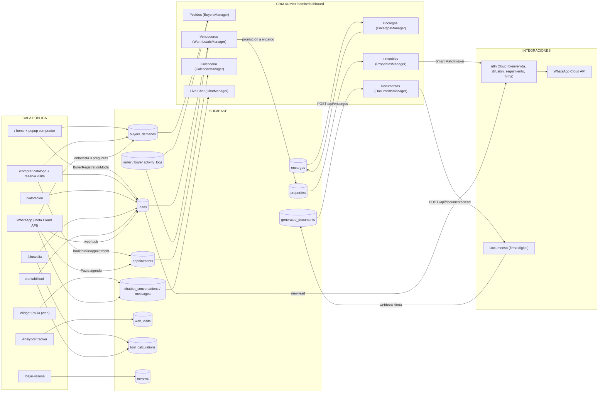
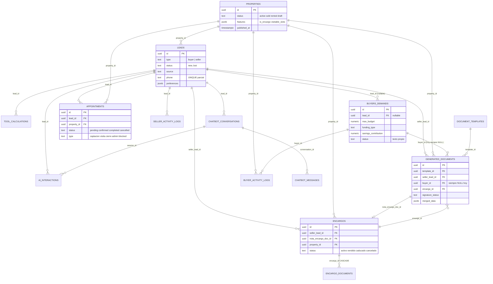
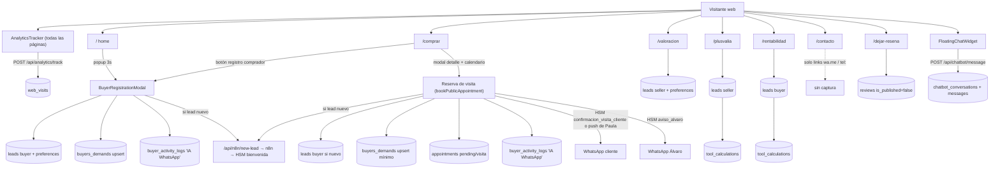
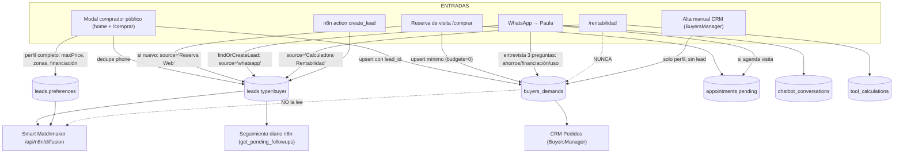
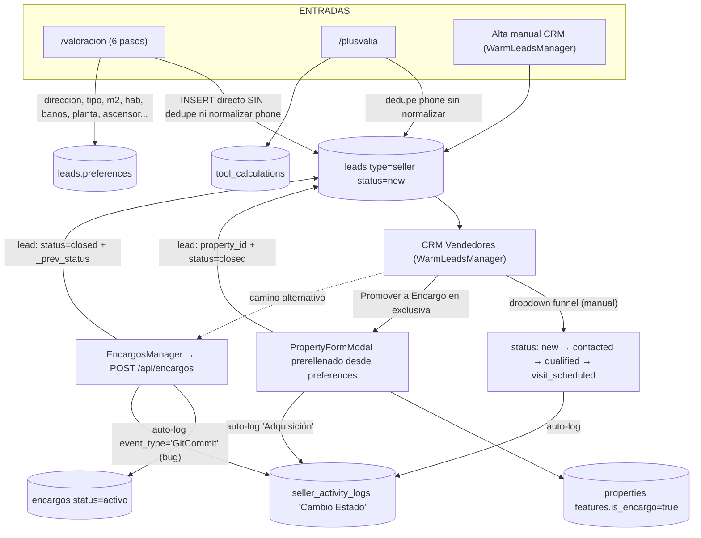
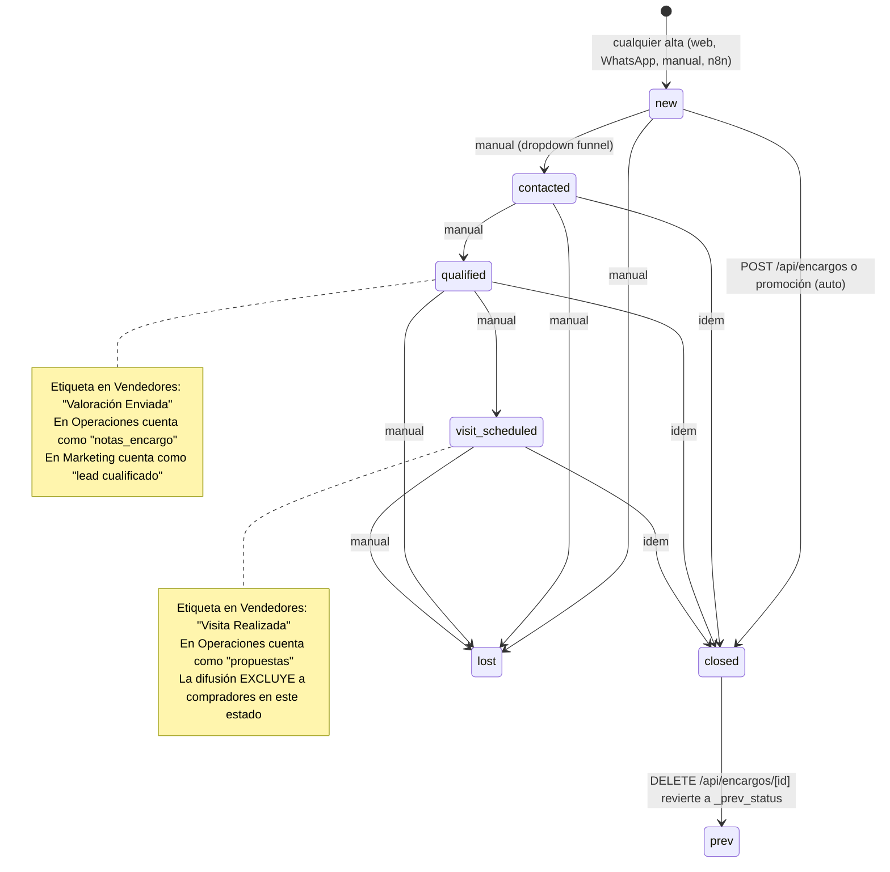
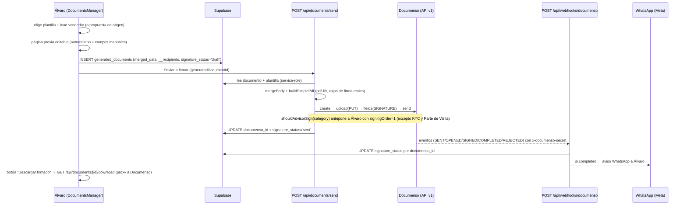

# Análisis as-is del flujo de trabajo del CRM — Tu Asesor V2

> ⚠️ **Documento as-is a fecha 2026-06-10 — FOTO HISTÓRICA, no estado actual.** Los problemas
> #1–#17 identificados aquí se abordaron en los briefs ejecutores #007–#009 (2026-06-10/11) —
> ver el estado real y los cambios aplicados en `docs/sync/SYNC_AI.md` y en la cabecera de
> `docs/CRM-GUIDE.md`. Este análisis NO se reescribe a propósito.

> **Tipo:** ingeniería inversa documental (read-only). **Fecha:** 2026-06-10.
> **Commit de referencia:** `4a57369` (master). **Encargo:** `docs/prompts/analisis-flujo-crm.md`.
> **Método:** lectura directa del código + introspección del schema Supabase (proyecto `hmzqgtitlonaxbwlhcob`)
> + consultas `SELECT` sobre datos reales + GitNexus como mapa orientativo (⚠️ su índice estaba 83 commits
> atrasado y NO se reindexó para no tocar AGENTS.md/CLAUDE.md; toda afirmación de este documento está
> verificada contra el código actual, no contra el índice).
> Las afirmaciones no confirmadas de primera mano se marcan con `⚠️ NO VERIFICADO`.

---

## 1. Resumen ejecutivo

Tu Asesor V2 es una única app Next.js con dos caras: una **web pública** (catálogo, calculadoras,
chatbot "Paula", reserva online de visitas) que captura leads en Supabase, y un **CRM admin**
(`/admin/dashboard`, 12 pestañas) donde Álvaro gestiona compradores (`buyers_demands`), vendedores
(`leads type=seller`), encargos en exclusiva (tabla `encargos`), inmuebles (`properties`), citas
(`appointments`) y documentos legales con firma digital (`document_templates` → `generated_documents`
→ Documenso). Las automatizaciones viven en tres sitios: el motor del chatbot
([engine.ts](../../src/lib/chatbot/engine.ts) + [scheduling.ts](../../src/lib/chatbot/scheduling.ts)),
los webhooks de la app (`/api/webhooks/*`) y 4-5 workflows de n8n Cloud (bienvenida, difusión,
seguimiento, firma). El sistema funciona end-to-end, pero arrastra **tres fracturas estructurales**:
(1) el perfil del comprador vive duplicado entre `leads.preferences` y `buyers_demands` y cada
consumidor lee de un sitio distinto; (2) "captar en exclusiva" tiene **dos caminos divergentes** que
no se sincronizan (promoción desde Vendedores vs alta en Encargos); y (3) los estados del funnel
(`qualified`, `visit_scheduled`) son etiquetas puramente manuales que cada vista interpreta con una
semántica diferente. El detalle está en las secciones 5-7 y el inventario completo en la sección 10.

---

## 2. Glosario de actores y entidades

### 2.1 Capa admin (verificada contra [AdminDashboard.tsx:311-344](../../src/components/admin/AdminDashboard.tsx))

| Actor / Entidad | Pestaña (id interno) | Componente | Tabla(s) que lee | Historial |
|---|---|---|---|---|
| Comprador | Pedidos (`buyers`) | `BuyersManager` | `buyers_demands` | `buyer_activity_logs` |
| Vendedor (en captación) | Vendedores (`warm_sellers`) | `WarmLeadsManager` | `leads` con `type='seller'` y `status≠'closed'` | `seller_activity_logs` |
| Encargo (expediente) | Encargos (`sellers` ⚠️ id engañoso) | `EncargosManager` + `EncargoFormModal` | `encargos`, `encargo_documents`, `generated_documents.encargo_id` | tab Actividad: mezcla `appointments` + `buyer_activity_logs` + `generated_documents` ([EncargosManager.tsx:446-462](../../src/components/admin/sections/EncargosManager.tsx)) |
| Inmueble | Inmuebles (`properties`) | `PropertiesManager` + `properties/*` | `properties` (`features` jsonb) | — |
| Documento legal | Documentos (`documents`) | `DocumentsManager` (+ `.types.ts`, `.utils.ts`) | `document_templates`, `generated_documents`, `leads type=seller` | `signature_status` (Documenso) |
| Cita | Calendario (`calendar`) | `CalendarManager` + `calendar/*` | `appointments` | — |
| Conversación | Live Chat (`chat`) | `ChatManager` | `chatbot_conversations`, `chatbot_messages` | — |
| Reseña / Blog / Webhooks / Heatmap | resto de tabs | `ReviewsManager`, `BlogManager`, `WebhooksManager`, `HeatmapManager` (placeholder) | `reviews`, `posts`, `n8n_webhook_logs` | — |

> Nota del mapa de partida del brief: **`SellersManager` ya no existe** (eliminado en el refactor del
> 2026-06-04) y las tablas **`offers` y `property_documents` fueron eliminadas** de la BD el
> 2026-06-08. La pestaña "Encargos" la sirve `EncargosManager` sobre la tabla `encargos`.

### 2.2 Capa pública

| Touchpoint | Ruta | Componente | Aterriza en |
|---|---|---|---|
| Home + popup comprador (a los 3 s) | `/` | `HomeBuyerPopup` → `BuyerRegistrationModal` | `leads type=buyer` + `buyers_demands` + `buyer_activity_logs` |
| Catálogo + detalle + reserva de visita | `/comprar` | página + modal detalle + `BuyerRegistrationModal` | `web_visits`; reserva → `appointments` + `leads` + `buyers_demands` |
| Calculadora valoración | `/valoracion` | página (6 pasos) | `leads type=seller` (inmueble entero en `preferences`) — **NO crea `properties` ni `tool_calculations`** |
| Calculadora plusvalía | `/plusvalia` | página + `leadService` | `leads type=seller` + `tool_calculations` |
| Calculadora rentabilidad | `/rentabilidad` | página + `leadService` | `leads type=buyer` + `tool_calculations` — **sin `buyers_demands`** |
| Contacto | `/contacto` | página | **nada** — solo CTAs a WhatsApp/teléfono ([contacto/page.tsx](../../src/app/contacto/page.tsx)) |
| Reseñas | `/dejar-resena` | página | `reviews` con `is_published=false` |
| Chatbot Paula (web) | widget → `/api/chatbot/message` | `FloatingChatWidget` | `chatbot_conversations` + `chatbot_messages` — **nunca crea lead** |
| Chatbot Paula (WhatsApp) | webhook Meta → `/api/webhooks/whatsapp` | — | `leads type=buyer source='whatsapp'` + conversación + (si agenda) `appointments` + `buyers_demands` |
| Tracking | todas las páginas | `AnalyticsTracker` → `/api/analytics/track` | `web_visits` |

---

## 3. Modelo de datos real

Introspección Supabase del 2026-06-10 (21 tablas públicas, todas con RLS). Filas = snapshot del día
(BD casi vacía tras el wipe de pruebas del 2026-06-04).

| Tabla | Filas | Columnas clave | FKs salientes |
|---|---|---|---|
| `leads` | 5 | `type` (buyer/seller), `status` (new/contacted/qualified/visit_scheduled/closed/lost), `source`, `preferences` jsonb, `phone` (UNIQUE parcial), `last_followup_at` | `property_id → properties` |
| `properties` | 1 | `status` (active/sold/rented/draft), `features` jsonb (`is_encargo`, `visitable_slots`, `floor`, `elevator`, `latitude/longitude`…), `published_at` | — |
| `buyers_demands` | 3 | `max_budget`, `min_sqm`, `rooms`, `preferred_zones[]`, `property_type`, `funding_type`, `savings_contribution`, `status` (texto: 'Búsqueda activa'…) | `lead_id → leads` (nullable) |
| `appointments` | 4 | `scheduled_at`, `status` (pending/confirmed/completed/cancelled), `type` (captacion/visita/cierre/admin/blocked), `cancelled_at/by/reason` | `lead_id`, `property_id` |
| `encargos` | 1 | `status` (activo/vendido/caducado/cancelado), `precio_captacion`, `honorarios_pct`, `fecha_firma`, `duracion_meses` | `seller_lead_id → leads`, `nota_encargo_doc_id → generated_documents`, `property_id → properties` |
| `encargo_documents` | 4 | `kind` (ibi/comunidad/energetica/nota_simple/otros), `file_url` (bucket `encargo-files`) | `encargo_id → encargos` (CASCADE) |
| `document_templates` | 6 | `name`, `category`, `body` con `{{placeholders}}` | — |
| `generated_documents` | 2 | `merged_data` jsonb (snapshot + `__recipients`/`__owners`/`__sellers`), `documenso_id`, `signature_status` (draft/sent/viewed/completed/rejected) | `template_id`, `property_id`, `seller_lead_id`, `buyer_id → buyers_demands`, `encargo_id` |
| `seller_activity_logs` | 7 | `event_type` (texto libre), `title`, `notes`, `event_date` | `lead_id → leads` |
| `buyer_activity_logs` | 4 | `event_type`, `title`, `notes`, `event_date` | `buyer_id → buyers_demands`, `property_id` |
| `chatbot_conversations` | 4 | `channel` (whatsapp/web_widget/chatwoot), `status` (active/escalated/closed), `metadata` jsonb (interview_state, cancel_flow, preferred_name, followups…) | `lead_id → leads` |
| `chatbot_messages` | 120 | `role`, `content`, `intent_detected`, `wa_message_id` | `conversation_id` |
| `ai_interactions` | **0** | `lead_id` **NOT NULL**, `intent`, `summary` | `lead_id`, `session_id → chatbot_conversations` |
| `tool_calculations` | **0** | `tool_type` (plusvalia/plusvalia_fiscal/rentabilidad), `inputs`, `results` | `lead_id` |
| `web_visits` | 32 | `session_id`, `page_path`, `referrer`, `ip_hash`, `source` | — |
| `n8n_webhook_logs` | 316 | `webhook_name`, `source`, `payload`, `response_status` | — |
| `reviews` | 1 | `rating` (1-5), `is_published` (default false) | — |
| `posts` | 14 | blog (slug único, `is_published`) | — |
| `operating_expenses` | 5 | gastos de FinanzasTab | — |
| `system_errors` | 5 | log de errores | — |

Tablas sin FK (no aparecen en el diagrama): `web_visits`, `n8n_webhook_logs`, `reviews`, `posts`,
`operating_expenses`, `system_errors`.

---

## 4. Capa pública / web

| Touchpoint | Dato capturado | Tabla destino (valores por defecto) | Automatización disparada |
|---|---|---|---|
| `AnalyticsTracker` (global) | session_id, page_path, referrer, UA, ip_hash, source deducido de UTM/referrer | `web_visits` ([track/route.ts](../../src/app/api/analytics/track/route.ts)) | ninguna |
| `/` + `/comprar` → `BuyerRegistrationModal` (público: [HomeBuyerPopup.tsx:27](../../src/components/HomeBuyerPopup.tsx), [comprar/page.tsx:1182](../../src/app/comprar/page.tsx)) | nombre, tel, email, zonas (texto o polígonos en mapa), tipo, `maxPrice`, `minRooms`, `minBaths`, parking, financiación, ahorros, notas, RGPD | `leads` (dedupe por phone, update si existe; [BuyerRegistrationModal.tsx:358-397](../../src/components/BuyerRegistrationModal.tsx)) con `preferences` = perfil completo; `buyers_demands` upsert con `lead_id` ([:412-436](../../src/components/BuyerRegistrationModal.tsx)); `buyer_activity_logs` `event_type='IA WhatsApp'` ([:449](../../src/components/BuyerRegistrationModal.tsx), [:495](../../src/components/BuyerRegistrationModal.tsx)) | si lead nuevo → `POST /api/n8n/new-lead` ([:403-407](../../src/components/BuyerRegistrationModal.tsx)) → workflow n8n → HSM `bienvenida_nuevo_lead` |
| `/comprar` → reserva de visita | nombre, tel, email, inmueble, fecha+slot, notas | `leads` (dedupe phone, [appointmentService.ts:79-105](../../src/lib/appointmentService.ts)) `type='buyer' source='Reserva Web' status='new'`; `buyers_demands` upsert **con presupuestos a 0** ([:190-228](../../src/lib/appointmentService.ts)); `appointments` `status='pending' type='visita'` 30 min ([:254-267](../../src/lib/appointmentService.ts)); `buyer_activity_logs` 'IA WhatsApp' ([:231-240](../../src/lib/appointmentService.ts)) | n8n new-lead si nuevo ([:131-167](../../src/lib/appointmentService.ts)); WhatsApp al cliente: HSM `confirmacion_visita_cliente` **o** push libre de Paula si ya hay conversación (lógica anti-duplicado en [:280-293](../../src/lib/appointmentService.ts)); HSM `aviso_alvaro` al asesor; intenta arrancar entrevista de Paula (`startInterviewFromWebBooking`) |
| `/valoracion` | tipo, dirección completa, planta, m², hab, baños, ascensor/terraza/garaje, estado, nombre, apellido, email, tel, RGPD | **INSERT directo sin dedupe** en `leads` `type='seller' source='Calculadora Valoración'`, inmueble completo en `preferences` ([valoracion/page.tsx:115-140](../../src/app/valoracion/page.tsx)). NO crea `properties` ni `tool_calculations` | ninguna |
| `/plusvalia` | datos fiscales (valores y fechas de compra/venta, valor catastral) + nombre, tel | `leads` `type='seller' source='Calculadora Plusvalía'` (dedupe por phone **sin normalizar**, [leadService.ts:54-77](../../src/lib/leadService.ts)) + `tool_calculations` `tool_type='plusvalia'/'plusvalia_fiscal'` ([:97-103](../../src/lib/leadService.ts)) | ninguna (botón WhatsApp manual en paso 3) |
| `/rentabilidad` | datos de inversión + nombre, tel | `leads` `type='buyer' source='Calculadora Rentabilidad'` + `tool_calculations` `tool_type='rentabilidad'` (mismo `leadService`) | ninguna |
| `/contacto` | nada | nada | links `wa.me` / `tel:` |
| `/dejar-resena` | nombre, rating, comentario | `reviews` `is_published=false` | ninguna (moderación manual en ReviewsManager) |
| Widget Paula | mensaje, `conversation_id` (localStorage), visitor_name opcional | `chatbot_conversations` `channel='web_widget'` **sin lead** ([chatbot/message/route.ts:28-44](../../src/app/api/chatbot/message/route.ts)) + `chatbot_messages` | escalación = solo cambia `status='escalated'` (sin aviso WhatsApp en canal web) |
| WhatsApp entrante | mensaje + perfil Meta | ver sección 5.1 | ver sección 5.1 |

**Formularios que escriben donde el admin no lee** (resumen; detalle en sección 10):
`/rentabilidad` crea compradores que **no aparecen en Pedidos** (no crea `buyers_demands`);
la entrevista de Paula escribe el perfil en `buyers_demands` pero la **difusión lee
`leads.preferences`**; el widget web conversa sin crear lead aunque el visitante dé su nombre.

---

## 5. Flujos de entrada (detalle)

### 5.1 Comprador

**Caminos y dónde aterriza cada uno:**

1. **Modal comprador público** (`BuyerRegistrationModal`, montado en home con popup a los 3 s, en
   `/comprar` y en `SubscribeSection`): es el único camino que rellena **las dos** estructuras de
   perfil — `leads.preferences` (claves `maxPrice`, `minRooms`, `propertyType`, `polygons`,
   `paymentMethod`, `savingsContribution`… [BuyerRegistrationModal.tsx:337-350](../../src/components/BuyerRegistrationModal.tsx))
   y `buyers_demands` (`max_budget`, `preferred_zones`, `funding_type`, `lead_id`…
   [:412-436](../../src/components/BuyerRegistrationModal.tsx)). Dispara bienvenida n8n si el lead es nuevo.
2. **Reserva web de visita** (`bookPublicAppointment`): crea lead si no existe
   ([appointmentService.ts:95-105](../../src/lib/appointmentService.ts)), upsert de `buyers_demands`
   **casi vacío** (presupuestos a 0 — el perfil real queda pendiente "para el bot o Álvaro",
   [:213-228](../../src/lib/appointmentService.ts)), cita `pending`, log 'IA WhatsApp', bienvenida n8n,
   confirmación HSM o push de Paula, aviso a Álvaro. **El `status` del lead se queda en `'new'`:
   nadie lo pasa a `visit_scheduled`.**
3. **WhatsApp → Paula**: `findOrCreateLead` crea `type='buyer', source='whatsapp', status='new'`
   ([whatsapp/route.ts:427-433](../../src/app/api/webhooks/whatsapp/route.ts)) con phone normalizado
   E.164 y manejo de la colisión 23505. Si el cliente agenda visita y no tiene perfil, Paula lanza la
   entrevista de 3 preguntas y hace `upsertBuyerDemand` (con `lead_id`) — el perfil aterriza en
   `buyers_demands`, **no** en `leads.preferences`.
4. **`/rentabilidad`**: lead `type='buyer'` + cálculo. **No crea `buyers_demands`** → invisible en
   Pedidos; sin `preferences.maxPrice` → invisible para la difusión.
5. **n8n `create_lead`** ([webhooks/n8n/route.ts](../../src/app/api/webhooks/n8n/route.ts)): alta
   genérica con dedupe por phone (pensado para Meta Ads u orígenes externos; hoy ningún workflow
   activo lo usa de forma evidente — ⚠️ NO VERIFICADO en n8n, fuera del alcance read-only).
6. **Alta manual en Pedidos** (`BuyersManager`): crea **solo** `buyers_demands` + log automático
   'Llamada telefónica / Perfil registrado en CRM'
   ([BuyersManager.tsx:276-282](../../src/components/admin/sections/BuyersManager.tsx)) — **sin lead**.

**Relación `leads type=buyer` ↔ `buyers_demands` (la duda central del brief):**
- `leads` = **identidad y funnel**: contacto, source, status del embudo, destinatario de
  automatizaciones (bienvenida, seguimiento diario, difusión).
- `buyers_demands` = **perfil de búsqueda**: presupuesto, zonas, financiación; es lo que ve la
  pestaña Pedidos y lo que alimenta el autorrelleno teórico de documentos.
- **No se sincronizan**: nombre/teléfono/email viven duplicados en ambas; `lead_id` (FK nullable,
  añadida 2026-06-08) solo la escriben el modal público, la reserva web y la entrevista de Paula. El
  alta manual de Pedidos no crea lead, y editar un comprador en Pedidos no actualiza su lead.
- Consecuencia operativa: **la difusión matchea contra `leads.preferences`**
  ([diffusion/route.ts:100-104 y 164-175](../../src/app/api/n8n/diffusion/route.ts)), de modo que un
  comprador perfilado solo en `buyers_demands` (vía Paula o alta manual) **no recibe difusiones**.

### 5.2 Vendedor

**Qué crea exactamente `/valoracion`** (pregunta 2 del brief): un único INSERT en `leads` con
`type='seller'`, `source='Calculadora Valoración'`, `status` por defecto (`'new'`), y **todas** las
características del inmueble (dirección compuesta, tipo, m², habitaciones, baños, planta, ascensor,
terraza, garaje, estado, ciudad, CP, RGPD) dentro de `leads.preferences`
([valoracion/page.tsx:113-140](../../src/app/valoracion/page.tsx)). **No crea `properties`** (decisión
explícita comentada en [:111-112](../../src/app/valoracion/page.tsx): la conversión a
Inmueble/Encargo es manual de Álvaro) y **no escribe `tool_calculations`**. Sin `price` ni `status`
de property porque no hay property. ⚠️ Riesgo: inserta **sin buscar lead existente y sin
`normalizeEsPhone`** — ver problema #4.

---

## 6. Ciclo de vida Lead → Encargo → Inmueble

### 6.1 Estados del funnel (`leads.status`)

Definidos en [types/index.ts:9](../../src/types/index.ts) y etiquetados en
[WarmLeadsManager.tsx:76-83](../../src/components/admin/sections/WarmLeadsManager.tsx):

| Origen → Destino | Quién/qué lo dispara | Evidencia |
|---|---|---|
| `*` → `new` | toda alta de lead (todas las fuentes usan el default) | p. ej. [appointmentService.ts:97-105](../../src/lib/appointmentService.ts), [whatsapp/route.ts:427-433](../../src/app/api/webhooks/whatsapp/route.ts) |
| cualquiera → cualquiera | **manual**: dropdown del funnel en Vendedores (+ auto-log 'Cambio Estado') | [WarmLeadsManager.tsx:256-283](../../src/components/admin/sections/WarmLeadsManager.tsx) |
| cualquiera → cualquiera | acción n8n `update_lead_status` (valida los 6 estados) | [webhooks/n8n/route.ts:120-141](../../src/app/api/webhooks/n8n/route.ts) |
| cualquiera → `closed` | **auto** al crear encargo (`POST /api/encargos`, guarda `_prev_status`) | [encargos/route.ts:143-159](../../src/app/api/encargos/route.ts) |
| cualquiera → `closed` | **auto** al "Promover a Encargo" desde Vendedores | [WarmLeadsManager.tsx:399-415](../../src/components/admin/sections/WarmLeadsManager.tsx) |
| `closed` → `_prev_status` | **auto** al borrar el encargo (solo si sigue `closed`) | [encargos/[id]/route.ts:116-133](../../src/app/api/encargos/%5Bid%5D/route.ts) |

**Hallazgo clave (resuelve la duda de Álvaro):** `qualified` y `visit_scheduled` **no los asigna
ningún proceso automático**. La reserva web crea la cita pero deja el lead en `new`; Paula agenda
visitas sin tocar `leads.status`; las calculadoras crean en `new`. Son etiquetas que solo cambian a
mano, y además **cada vista las interpreta distinto**:
- Vendedores: `qualified`="Valoración Enviada", `visit_scheduled`="Visita Realizada"
  ([WarmLeadsManager.tsx:78-80](../../src/components/admin/sections/WarmLeadsManager.tsx)).
- Operaciones: `qualified`→contador "notas_encargo", `visit_scheduled`→"propuestas"
  ([operacionesUtils.ts:32-33](../../src/components/admin/sections/dashboard/operaciones/operacionesUtils.ts)).
- Marketing: `qualified|visit_scheduled|closed` = "leads cualificados" para la tasa de conversión
  ([MarketingTab.tsx:68-69](../../src/components/admin/sections/dashboard/MarketingTab.tsx)).
- Difusión: solo incluye compradores en `new|contacted|qualified`
  ([diffusion/route.ts:104](../../src/app/api/n8n/diffusion/route.ts)) — poner `visit_scheduled` a un
  comprador lo saca de las difusiones.

### 6.2 Los DOS caminos a "Encargo" (no sincronizados)

| | Camino A — "Promover a Encargo" (Vendedores) | Camino B — Alta en Encargos |
|---|---|---|
| UI | botón en drawer del lead → `PropertyFormModal` prerellenado desde `preferences` | `EncargoFormModal` → `POST /api/encargos` |
| Crea | `properties` con `features.is_encargo=true` y `status='active'` | fila en `encargos` (`status='activo'`), property **opcional** |
| Vincula | `leads.property_id` = nueva property | `encargos.seller_lead_id`, `nota_encargo_doc_id`, `generated_documents.encargo_id` |
| Lead | `status='closed'` (sin guardar el anterior) | `status='closed'` + `preferences._prev_status` (reversible al borrar) |
| Timeline | `event_type='Adquisición'`, "Encargo firmado en exclusiva" ([WarmLeadsManager.tsx:409-415](../../src/components/admin/sections/WarmLeadsManager.tsx)) | `event_type='GitCommit'` (bug), "Captado en exclusiva" ([encargos/route.ts:163-170](../../src/app/api/encargos/route.ts)) |
| ¿Aparece en la pestaña Encargos? | **NO** (EncargosManager lee la tabla `encargos`, no `features.is_encargo`) | SÍ |
| ¿Aparece en Inmuebles/web? | SÍ (es una property activa) | solo si después se vincula `property_id` |

**Qué distingue hoy un encargo de un inmueble de catálogo:** el inmueble es una fila de `properties`
(publicación web); el encargo es una fila de `encargos` (expediente jurídico: nota firmada, anexos
IBI/comunidad/energética/nota simple, honorarios, duración). El flag `features.is_encargo` es un
**vestigio de la Fase 1-2 (2026-05-29)** que el camino A sigue escribiendo pero que la pestaña
Encargos ya no lee. La relación `leads.property_id ↔ properties.id` solo la establece el camino A
(y la reserva web de compradores, con otra semántica: "inmueble de interés").

---

## 7. Sistema de eventos e historiales (núcleo)

### 7.1 `seller_activity_logs` (timeline del vendedor)

Mecanismos de creación: 3 auto-inyectados + formulario manual del drawer (tipo, título, notas y
`datetime-local` opcional). Si el hito manual lleva fecha/hora, **además** crea una cita
([WarmLeadsManager.tsx:333-349](../../src/components/admin/sections/WarmLeadsManager.tsx)):
`Nota de visita`→`type='visita'`, `Adquisición`→`type='captacion'`, resto→`type='admin'`.

| Evento | Cómo se crea | Efecto real HOY | Efecto esperado / hueco |
|---|---|---|---|
| `Cambio Estado` | **auto** al mover el dropdown del funnel ([:276-283](../../src/components/admin/sections/WarmLeadsManager.tsx)) | inserta texto "de X a Y" | el cambio de estado no dispara nada más: pasar a `qualified` no envía la valoración, `visit_scheduled` no crea cita |
| `Adquisición` | **auto** en promoción ([:409-415](../../src/components/admin/sections/WarmLeadsManager.tsx)); también opción manual | texto; manual con fecha → cita `captacion` | no crea fila `encargos`, no genera Nota de Encargo, no avisa |
| `GitCommit` | **auto** al crear encargo vía API ([encargos/route.ts:163-170](../../src/app/api/encargos/route.ts)) | texto con tipo erróneo (cae al icono default del timeline) | debería ser un tipo legible ('Adquisición'/'Encargo creado') |
| `Llamada` / `Email` / `Valoración` | manual ([:318-326](../../src/components/admin/sections/WarmLeadsManager.tsx)) | texto; con fecha → cita `admin` | sin recordatorio ni cambio de estado; 'Valoración' no envía nada al cliente |
| `Nota de visita` | manual | texto; con fecha → cita `visita` | no toca `appointments` existentes ni el estado del lead |

### 7.2 `buyer_activity_logs` (timeline del comprador)

| Evento | Cómo se crea | Efecto real HOY | Efecto esperado / hueco |
|---|---|---|---|
| `IA WhatsApp` | **auto** en: registro web del modal ([BuyerRegistrationModal.tsx:495](../../src/components/BuyerRegistrationModal.tsx)), actualización de perfil web ([:449](../../src/components/BuyerRegistrationModal.tsx)), reserva web ([appointmentService.ts:231-240](../../src/lib/appointmentService.ts)) | solo texto | el nombre es engañoso: 2 de los 3 orígenes son formularios web, no IA ni WhatsApp |
| `Llamada telefónica` | **auto** al crear perfil en Pedidos ([BuyersManager.tsx:276-282](../../src/components/admin/sections/BuyersManager.tsx)); también default del form manual | solo texto | un alta manual no es una llamada; semántica confusa |
| `Visita física realizada` | manual | solo texto | no marca `appointments.status='completed'` ni crea cita |
| `Oferta presentada` | manual | solo texto | no crea Propuesta en Documentos ni vincula importe |
| `Contrato firmado` | manual | solo texto | no toca `generated_documents`, `encargos` ni `buyers_demands.status` |

**Conclusión del núcleo:** hoy los dos timelines son **registros narrativos**. El único efecto
colateral real es la creación de citas desde el timeline del vendedor cuando el hito lleva
fecha/hora. Ningún evento cambia estados, genera documentos, ni dispara notificaciones.

### 7.3 `appointments` y su relación con los timelines

- **Quién crea citas:** Paula al agendar (`status='pending', type='visita'`, 30 min,
  [scheduling.ts](../../src/lib/chatbot/scheduling.ts)); la reserva web
  ([appointmentService.ts:254-267](../../src/lib/appointmentService.ts)); el calendario manual
  (`AppointmentFormModal`); el timeline de vendedores con fecha (visita/captación/admin); la acción
  n8n `create_appointment`.
- **Enlaces:** siempre `lead_id` y opcionalmente `property_id`. El tab Actividad del encargo mezcla
  `appointments` (por `lead_id` O `property_id`), `buyer_activity_logs` (por `property_id`) y
  `generated_documents` (por `encargo_id`) ([EncargosManager.tsx:446-462](../../src/components/admin/sections/EncargosManager.tsx)).
- **Estados:** nacen `pending` y **nadie las confirma automáticamente**; existe el botón manual
  "Confirmar" (HSM `confirmacion_visita_cliente`) en
  [RouteListView.tsx](../../src/components/admin/sections/calendar/RouteListView.tsx) →
  [send-confirmation/route.ts](../../src/app/api/appointments/%5Bid%5D/send-confirmation/route.ts).
- **Cancelación por el cliente (Paula):** soft-delete con `cancelled_at/by/reason`, 5 guardarraíles
  (filtro por lead, rate-limit 3/24 h, ventana mínima 4 h, confirmación en 2 turnos, aviso a Álvaro).
- **Las citas NO escriben en los timelines**: una visita agendada/cancelada por Paula no deja hito en
  `buyer_activity_logs` (solo el aviso WhatsApp a Álvaro).

---

## 8. Documentos legales

### 8.1 Flujo generación → firma → webhook

### 8.2 Mapa placeholder → fuente de dato

Placeholders extraídos por SQL de las 6 plantillas reales en `document_templates` (2026-06-10).
"Manual" = se teclea en la página previa editable.

| Plantilla (category) | Placeholder | Fuente real |
|---|---|---|
| Nota de Encargo | `{{propietarios}}`, `{{representacion}}` | lista de propietarios del formulario (el principal se preinicializa desde `leads.name/email/phone`) |
| | `{{inmueble.direccion}}`, `{{inmueble.m2}}`, `{{inmueble.m2_construidos}}` | `leads.preferences` (property_address, sqm…) → editable |
| | `{{inmueble.referencia_catastral}}`, `{{inmueble.datos_registrales}}`, `{{cargas}}`, `{{inmueble.anexos}}` | manual |
| | `{{precio}}` | `leads.preferences.agent_valuation` → editable |
| | `{{honorarios_pct}}`, `{{fecha_inicio}}`, `{{fecha_fin}}`, `{{duracion_meses}}`, `{{fecha}}` | manual / fecha de hoy |
| Propuesta de Compraventa | `{{compradores}}` | **owners tecleados a mano** en el modal (no salen de `buyers_demands`) |
| | `{{vendedores}}`, `{{representacion}}` | lead vendedor + manual |
| | `{{pago.inicial}}`, `{{pago.ampliacion}}`, `{{pago.restante}}`, `{{plazo.contrato}}`, `{{plazo.escritura}}`, `{{dias_habiles}}` | escalera de pagos manual |
| | `{{inmueble.*}}`, `{{precio}}`, `{{cargas}}`, `{{lugar}}`, `{{fecha}}` | preferences/manual |
| Contrato Privado | `{{compradores}}`, `{{vendedores_full}}` | **`merged_data.__owners`/`__sellers` de la Propuesta de origen** ([DocumentsManager.tsx:200-209](../../src/components/admin/sections/DocumentsManager.tsx)) |
| | `{{honorarios_pct}}` | Nota de Encargo del mismo seller_lead si existe ([:213-219](../../src/components/admin/sections/DocumentsManager.tsx)) |
| | `{{notario.*}}`, `{{registro.*}}`, `{{iban_vendedor}}`, `{{forma_pago_ampliacion}}`, `{{total_entregado}}` | manual |
| Ficha 218/2005 | `{{itp_pct}}` (default 7 %), `{{itp_importe}}`, `{{gastos_notaria_registro}}` (1,5 %), `{{total_estimado_comprador}}` | calculados sobre `{{precio}}` en el modal |
| | `{{cert.letra/consumo/emisiones}}`, `{{anyo_construccion}}`, `{{cuota_comunidad}}`, `{{fecha_nota_simple}}` | manual |
| KYC PBC | `{{comprador.nombre}}`, `{{comprador.dni}}` | owners de la propuesta de origen o manual |
| | `{{titularidad_*}}`, `{{prp_*}}`, `{{origen_*}}`, `{{actividad_profesional}}` | radio buttons / manual |
| Parte de Visita | `{{fecha_visita}}`, `{{inmueble.direccion}}`, `{{precio}}`, `{{honorarios_pct}}`, `{{lugar}}` | manual / preferences |

**¿De dónde sale el comprador para el autorrelleno?** (pregunta 5 del brief): **NO sale de
`buyers_demands`**. En los tres caminos de generación el campo `buyerId` se inicializa a `""`
([DocumentsManager.tsx:126](../../src/components/admin/sections/DocumentsManager.tsx),
[:229](../../src/components/admin/sections/DocumentsManager.tsx),
[:316](../../src/components/admin/sections/DocumentsManager.tsx)) y el INSERT guarda
`buyer_id: form.buyerId || null` ([:592](../../src/components/admin/sections/DocumentsManager.tsx)) —
es decir, **siempre NULL**. El comprador se teclea como "owners" en la Propuesta y de ahí se hereda
(`__owners` en `merged_data`) al Contrato/Ficha/KYC. La decisión de Fase 4a ("comprador para
autorrelleno = buyers_demands", SYNC_AI 2026-05-29) quedó sin implementar.

**Firmantes:** `merged_data.__recipients` (todos los propietarios con email válido) con fallback a
vendedor/comprador; `shouldAdvisorSign` antepone a Álvaro (`signingOrder: 1`, firma secuencial) en
Nota, Propuesta, Contrato y Ficha; lo excluye en KYC y Parte de Visita
([documenso.ts](../../src/lib/documenso.ts), [documents/send/route.ts](../../src/app/api/documents/send/route.ts)).

---

## 9. Integraciones que tocan el flujo

| Integración | Qué dispara | Cuándo |
|---|---|---|
| **Paula — WhatsApp** ([webhooks/whatsapp/route.ts](../../src/app/api/webhooks/whatsapp/route.ts) + [engine.ts](../../src/lib/chatbot/engine.ts)) | crea lead+conversación; read receipt + typing; intents (`schedule_visit`, `cancel_visit` con backstop regex, `ask_price` con follow-up a 3 h, entrevista de perfil reactiva); escalación → `status='escalated'` + HSM a Álvaro (throttle 15 min); `/bot` reactiva; auto-desescalado a los 3 días | cada mensaje entrante |
| **Paula — widget web** ([chatbot/message/route.ts](../../src/app/api/chatbot/message/route.ts)) | conversación anónima `web_widget`; mismo engine **sin teléfono** → no puede agendar ni crear lead; escalación solo marca estado | cada mensaje del widget |
| **n8n — `Notificacion Nuevo Lead`** | HSM `bienvenida_nuevo_lead` | `POST /api/n8n/new-lead`, llamado por `BuyerRegistrationModal` y `bookPublicAppointment` (solo lead nuevo). Las calculadoras NO lo llaman |
| **n8n — `Difusion Inteligente`** | HSM `nueva_propiedad_match` (7 vars) por destinatario + log al CRM | botón Smart Matchmaker en Inmuebles → `POST /api/n8n/diffusion` (matching server-side contra `leads` buyers `new/contacted/qualified` por geo+presupuesto+tipo+habitaciones) |
| **n8n — `Seguimiento Leads Diario`** (cron L-V 9:00) | HSM `seguimiento_lead` a buyers inactivos ≥60 días (cooldown 90 d, tope 20/día); marca `last_followup_at` ANTES de enviar | acción `get_pending_followups` del bridge |
| **n8n — bridge** ([webhooks/n8n/route.ts](../../src/app/api/webhooks/n8n/route.ts)) | 8 acciones: `create_lead`, `update_lead_status`, `create_appointment`, `get_properties`, `log_interaction` (único escritor de `ai_interactions`), `send_chatbot_response`, `get_pending_followups`, `get_pending_visit_followups` (ventana 10-21 h Madrid) | a demanda de n8n |
| **n8n — `Enviar Documento a Firmar`** | `POST /webhook/send-to-sign` → llama a `/api/documents/send` → aviso a Álvaro | ⚠️ NO VERIFICADO en n8n (read-only); documentado en SYNC_AI 2026-05-31 |
| **WhatsApp Cloud API** ([whatsapp.ts](../../src/lib/whatsapp.ts)) | `sendWhatsAppMessage` (texto libre, ventana 24 h), `sendWhatsAppTemplate` (HSM aprobadas: `bienvenida_nuevo_lead`, `nueva_propiedad_match`, `seguimiento_lead`, `confirmacion_visita_cliente`, `aviso_alvaro`), `markWhatsAppRead` | en todos los flujos anteriores |
| **Documenso** | firma digital (API v1: create→upload→fields→send) + webhook de estados + descarga proxy | sección 8 |
| **Chatwoot** ([webhooks/chatwoot/route.ts](../../src/app/api/webhooks/chatwoot/route.ts)) | recibiría mensajes y los guardaría como conversación `channel='chatwoot'` | **sin llamadores conocidos — aparentemente muerto** |

---

## 10. 🔴 Inventario de problemas

> Severidad: **alta** = rompe datos/flujo o engaña al usuario · **media** = fricción/datos
> inconsistentes · **baja** = cosmético/deuda.

1. **`event_type: "GitCommit"` al crear encargo** · [encargos/route.ts:165](../../src/app/api/encargos/route.ts) ·
   El log auto-inyectado "Captado en exclusiva" usa como tipo el **nombre del icono lucide** del
   evento 'Cambio Estado' ([WarmLeadsManager.tsx:519](../../src/components/admin/sections/WarmLeadsManager.tsx)) —
   copy-paste del icono como tipo. Ya hay 1 fila en producción. El timeline lo pinta con icono
   default y texto "GitCommit". · Impacto: timeline confuso, imposible filtrar por tipo real. ·
   **Severidad: alta** (es el evento de la transición más importante del funnel). Posible dirección:
   renombrar a un tipo legible.

2. **Dos caminos divergentes a "Encargo" sin sincronía** ·
   [WarmLeadsManager.tsx:399-422](../../src/components/admin/sections/WarmLeadsManager.tsx) vs
   [encargos/route.ts:108-173](../../src/app/api/encargos/route.ts) · La promoción desde Vendedores
   crea property con `features.is_encargo` pero **no crea fila en `encargos`** → el encargo no
   aparece en la pestaña Encargos ni tiene expediente; el alta en Encargos no exige property. Además
   el camino A cierra el lead **sin guardar `_prev_status`** (irreversible) y cada camino escribe un
   `event_type` distinto. · Impacto: dos definiciones de "captado", expedientes incompletos, lead no
   reversible según el camino. · **Severidad: alta**.

3. **La difusión no ve a los compradores perfilados por Paula ni a los de Pedidos** ·
   [diffusion/route.ts:100-104, 164-175](../../src/app/api/n8n/diffusion/route.ts) · El matchmaker
   matchea contra `leads.preferences` (`maxPrice`, `propertyType`, `minRooms`, lat/lng/polygons),
   claves que solo escribe `BuyerRegistrationModal`. La entrevista de Paula escribe en
   `buyers_demands` ([scheduling.ts](../../src/lib/chatbot/scheduling.ts), `upsertBuyerDemand`); el
   alta manual de Pedidos también; `/rentabilidad` no escribe perfil en ningún sitio. Ninguno de esos
   compradores matchea jamás. Nota: SYNC_AI.md (2026-06-08) afirma que la difusión lee
   `buyers_demands` — **es incorrecto**. · Impacto: difusiones que ignoran a la mayoría de los
   compradores reales del CRM. · **Severidad: alta**.

4. **`/valoracion` inserta leads sin dedupe ni normalización de teléfono** ·
   [valoracion/page.tsx:115-122](../../src/app/valoracion/page.tsx) · INSERT directo con
   `formData.phone` crudo. Desde el índice único `leads_phone_unique` (2026-06-09): si el teléfono ya
   existe con el mismo formato → error 23505 y el formulario falla para el usuario; si existe con
   otro formato (`+34` vs sin prefijo) → duplicado lógico. · Impacto: pérdida de leads de valoración
   o duplicados. · **Severidad: alta**.

5. **Estados `qualified`/`visit_scheduled` sin asignación automática y con 3 semánticas** ·
   [types/index.ts:9](../../src/types/index.ts),
   [WarmLeadsManager.tsx:78-80](../../src/components/admin/sections/WarmLeadsManager.tsx),
   [operacionesUtils.ts:32-33](../../src/components/admin/sections/dashboard/operaciones/operacionesUtils.ts),
   [MarketingTab.tsx:68-69](../../src/components/admin/sections/dashboard/MarketingTab.tsx),
   [diffusion/route.ts:104](../../src/app/api/n8n/diffusion/route.ts) · Solo se asignan a mano;
   Vendedores los etiqueta "Valoración Enviada"/"Visita Realizada", Operaciones los cuenta como
   "notas de encargo"/"propuestas", Marketing como "cualificados", y la difusión excluye
   `visit_scheduled`. La reserva web y Paula crean citas sin mover el lead de `new`. · Impacto:
   funnel y KPIs del dashboard no significan lo mismo en ninguna vista; mover el estado tiene efectos
   ocultos (salir de la difusión). · **Severidad: alta**.

6. **`generated_documents.buyer_id` siempre NULL** ·
   [DocumentsManager.tsx:126, 229, 316, 592](../../src/components/admin/sections/DocumentsManager.tsx) ·
   `buyerId` se inicializa a `""` en los 3 caminos y nunca hay selector de `buyers_demands`; el
   comprador se teclea a mano. La FK y la decisión de diseño de Fase 4a quedaron vestigiales. ·
   Impacto: imposible cruzar documentos↔compradores; el autorrelleno del comprador no existe. ·
   **Severidad: media**.

7. **`event_type='IA WhatsApp'` para acciones que no son ni IA ni WhatsApp** ·
   [BuyerRegistrationModal.tsx:449, 495](../../src/components/BuyerRegistrationModal.tsx),
   [appointmentService.ts:235](../../src/lib/appointmentService.ts) · Registro web, actualización de
   perfil web y reserva web se etiquetan todos 'IA WhatsApp'; el alta manual en CRM se etiqueta
   'Llamada telefónica' ([BuyersManager.tsx:278](../../src/components/admin/sections/BuyersManager.tsx)). ·
   Impacto: el timeline del comprador miente sobre el origen de cada hito. · **Severidad: media**.

8. **Compradores de `/rentabilidad` invisibles en Pedidos** ·
   [rentabilidad/page.tsx](../../src/app/rentabilidad/page.tsx) + [leadService.ts:97-103](../../src/lib/leadService.ts) ·
   Crea `leads type='buyer'` sin `buyers_demands` → no aparecen en la pestaña Pedidos (que solo lee
   `buyers_demands`) ni matchean en difusión. Solo se les ve en Marketing/Operaciones como contadores. ·
   Impacto: leads de inversores quedan sin gestión visible. · **Severidad: media**.

9. **Dedupe por teléfono sin normalizar en `leadService`** ·
   [leadService.ts:54-57, 73-77](../../src/lib/leadService.ts) · Busca `eq('phone', phone.trim())` e
   inserta el crudo: `666...` y `+34666...` no matchean → duplicado lógico (el índice único no lo
   impide al ser strings distintos). Mismo lead repartido entre calculadoras y WhatsApp. ·
   Impacto: historiales fragmentados. · **Severidad: media**.

10. **El lead no avanza en el funnel cuando hay cita** ·
    [appointmentService.ts:97-105, 254-267](../../src/lib/appointmentService.ts),
    [scheduling.ts](../../src/lib/chatbot/scheduling.ts) · Ni la reserva web ni Paula tocan
    `leads.status` al crear `appointments`; el estado `visit_scheduled` existe pero ningún flujo lo
    usa. · Impacto: el funnel de Vendedores/los KPIs no reflejan la actividad real. ·
    **Severidad: media**.

11. **Eventos del timeline sin efectos (registro narrativo)** · sección 7 ·
    'Contrato firmado' no toca `generated_documents` ni `encargos`; 'Oferta presentada' no crea
    Propuesta; 'Visita física realizada' no completa la cita. Única excepción: hito de vendedor con
    fecha → crea cita. · Impacto: doble teclado y datos desincronizados entre timeline y entidades. ·
    **Severidad: media** (es el hueco que Álvaro quiere rediseñar; aquí solo se constata).

12. **`ai_interactions` huérfana** ·
    [webhooks/n8n/route.ts:198-233](../../src/app/api/webhooks/n8n/route.ts) (único escritor) ·
    0 filas en producción; el engine nunca la escribe y su `lead_id NOT NULL` la inutiliza para
    visitantes anónimos. · Impacto: tabla muerta + falsa sensación de telemetría IA. ·
    **Severidad: media-baja**.

13. **El widget web nunca captura el lead** ·
    [chatbot/message/route.ts:28-44](../../src/app/api/chatbot/message/route.ts) · La conversación es
    anónima aunque el visitante dé `visitor_name`; sin teléfono, Paula no puede agendar ni crear
    lead, y nadie pide el contacto. · Impacto: el canal web de Paula no genera leads. ·
    **Severidad: media**.

14. **Webhook Chatwoot sin llamadores** ·
    [webhooks/chatwoot/route.ts](../../src/app/api/webhooks/chatwoot/route.ts) · Sin referencias en
    el código ni en los workflows documentados. · Impacto: superficie muerta. · **Severidad: baja**.

15. **`tool_calculations` a 0 filas pese a código vivo** · BD (snapshot 2026-06-10) · `/plusvalia` y
    `/rentabilidad` escriben ahí, pero no hay ninguna fila desde el wipe del 2026-06-04.
    ⚠️ NO VERIFICADO si es ausencia de uso real o fallo silencioso (el insert va en try/catch
    no bloqueante). · **Severidad: baja** (vigilar).

16. **Id de pestaña `'sellers'` renderiza Encargos** ·
    [AdminDashboard.tsx:323-326](../../src/components/admin/AdminDashboard.tsx) · `'sellers'` →
    `EncargosManager` y `'warm_sellers'` → Vendedores. · Impacto: trampa para mantenimiento. ·
    **Severidad: baja**.

17. **Documentación de sincronía desfasada** · `docs/sync/SYNC_AI.md` (entrada 2026-06-08, Ola 5/R9) ·
    Afirma que la difusión lee `buyers_demands` (lee `leads`, problema #3); el brief de partida
    listaba tablas ya eliminadas (`offers`, `property_documents`) y un componente inexistente
    (`SellersManager`). · Impacto: agentes/desarrolladores futuros heredan un mapa falso. ·
    **Severidad: baja**.

---

## 11. ❓ Preguntas abiertas para Álvaro

1. **Camino canónico del encargo:** ¿la promoción desde Vendedores debería crear también la fila en
   `encargos` (y dejar `features.is_encargo` como simple vínculo), o el alta debe pasar siempre por
   la pestaña Encargos? Hoy conviven ambos sin hablarse (problema #2).
2. **Fuente única del perfil comprador:** indicaste que te inclinas por **`buyers_demands`**. Si se
   confirma, la difusión tendría que leer de ahí (hoy lee `leads.preferences`, problema #3) y el alta
   manual de Pedidos debería crear/vincular el lead. Queda pendiente tu decisión formal.
3. **Semántica operativa de `qualified` y `visit_scheduled`:** el código no la define (problema #5).
   ¿Qué significan para ti? (p. ej. `qualified` = "valoración entregada" y `visit_scheduled` =
   "visita de captación agendada"), ¿y deberían asignarse automáticamente (p. ej. cita creada →
   `visit_scheduled`)?
4. **¿Debe la reserva web / Paula avanzar el funnel del lead** al crear cita (problema #10)?
5. **Doble WhatsApp al comprador nuevo que reserva visita:** recibe la bienvenida
   (`bienvenida_nuevo_lead` vía n8n) **y** la confirmación (`confirmacion_visita_cliente`) casi a la
   vez. ¿Es intencional?
6. **`ai_interactions` y Chatwoot:** ¿se mantienen para un uso futuro o se retiran (problemas #12 y #14)?
7. **Eventos del timeline:** ¿cuáles deberían tener efecto real (tu rediseño)? La tabla de la
   sección 7 (columna "hueco") es el punto de partida.

---

## 12. Apéndice — índice de archivos, rutas y tablas

### Rutas API (18)

| Ruta | Qué hace |
|---|---|
| `POST /api/analytics/track` | registra visita en `web_visits` (source deducido de UTM/referrer) |
| `POST /api/chatbot/message` | Paula para el widget web (conversación anónima) |
| `GET/POST /api/webhooks/whatsapp` | verificación Meta + mensajes entrantes → Paula |
| `GET /api/webhooks/whatsapp/status` | comprobación de credenciales Meta |
| `POST /api/webhooks/n8n` | bridge con 8 acciones (leads, citas, follow-ups, `ai_interactions`) |
| `POST /api/webhooks/documenso` | estados de firma → `signature_status` + aviso WhatsApp |
| `POST /api/webhooks/chatwoot` | receptor Chatwoot (sin uso aparente) |
| `POST /api/n8n/new-lead` | reenvía lead nuevo al workflow de bienvenida |
| `POST /api/n8n/diffusion` | Smart Matchmaker server-side → workflow de difusión |
| `POST /api/documents/send` | genera PDF y lo envía a Documenso |
| `GET /api/documents/[id]/download` | proxy de descarga del PDF firmado |
| `GET/POST /api/encargos` · `PATCH/DELETE /api/encargos/[id]` | CRUD del expediente + auto-transición del lead |
| `POST /api/appointments/[id]/send-confirmation` | HSM de confirmación manual de cita |
| `POST /api/properties/[id]/ai-report` | informe IA del inmueble (Gemini, datos reales) |
| `POST /api/admin/chat/send` | respuesta manual del asesor en Live Chat (`agent_reply`) |
| `POST /api/ai/zones` | sugerencia de zonas (selector premium) |
| `GET /api/health` | healthcheck (EcosistemaTab) |

### Librerías clave

| Fichero | Qué hace |
|---|---|
| [src/lib/chatbot/engine.ts](../../src/lib/chatbot/engine.ts) | orquestador de Paula: multi-provider LLM + keywords, intents, backstop de cancelación, persistencia de metadata |
| [src/lib/chatbot/scheduling.ts](../../src/lib/chatbot/scheduling.ts) | agendado (slots `features.visitable_slots`), entrevista 3 preguntas, `upsertBuyerDemand`, cancelación con guardarraíles, parsers híbridos regex+LLM |
| [src/lib/chatbot/profileCheck.ts](../../src/lib/chatbot/profileCheck.ts) | entrevista reactiva (oferta de perfil al primer mensaje/neutro) |
| [src/lib/chatbot/llmParser.ts](../../src/lib/chatbot/llmParser.ts) | parser LLM barato con schema |
| [src/lib/whatsapp.ts](../../src/lib/whatsapp.ts) | `sendWhatsAppMessage`, `sendWhatsAppTemplate`, `markWhatsAppRead`, `normalizePhone` |
| [src/lib/phone.ts](../../src/lib/phone.ts) | `normalizeEsPhone` (E.164) |
| [src/lib/appointmentService.ts](../../src/lib/appointmentService.ts) | `bookPublicAppointment` (reserva web end-to-end) |
| [src/lib/leadService.ts](../../src/lib/leadService.ts) | lead + `tool_calculations` para plusvalía/rentabilidad |
| [src/lib/leadSources.ts](../../src/lib/leadSources.ts) | etiquetas canónicas de `source` |
| [src/lib/documenso.ts](../../src/lib/documenso.ts) | cliente Documenso v1, `buildSimplePdf`, `shouldAdvisorSign` |
| [src/lib/brandedDoc.ts](../../src/lib/brandedDoc.ts) | render HTML/PDF de plantillas (variantes corporate/legal) |

### Tablas

Ver sección 3. Vivas y centrales: `leads`, `properties`, `buyers_demands`, `appointments`,
`encargos`, `encargo_documents`, `document_templates`, `generated_documents`,
`seller_activity_logs`, `buyer_activity_logs`, `chatbot_conversations`, `chatbot_messages`,
`web_visits`, `n8n_webhook_logs`, `reviews`, `posts`, `operating_expenses`. Dudosas: `ai_interactions`
(huérfana), `tool_calculations` (0 filas), `system_errors` (escritores no auditados aquí —
⚠️ NO VERIFICADO).

### Workflows n8n (referencia, no inspeccionados en esta sesión)

`QikfXMJumWbpI3wL` Notificación Nuevo Lead · `6E0AP0gqLUliPQtN` Difusión Inteligente ·
`VnXhrEh2G8AeR0DT` Seguimiento Leads Diario · `X2qbhCUWngf9qmJI` Enviar Documento a Firmar ·
`tFk38qR62f1yEnuz` Generador Diario Blog. (Estados según SYNC_AI/SESSION_BOOTSTRAP —
⚠️ NO VERIFICADO en vivo en esta sesión para mantener el read-only estricto.)
