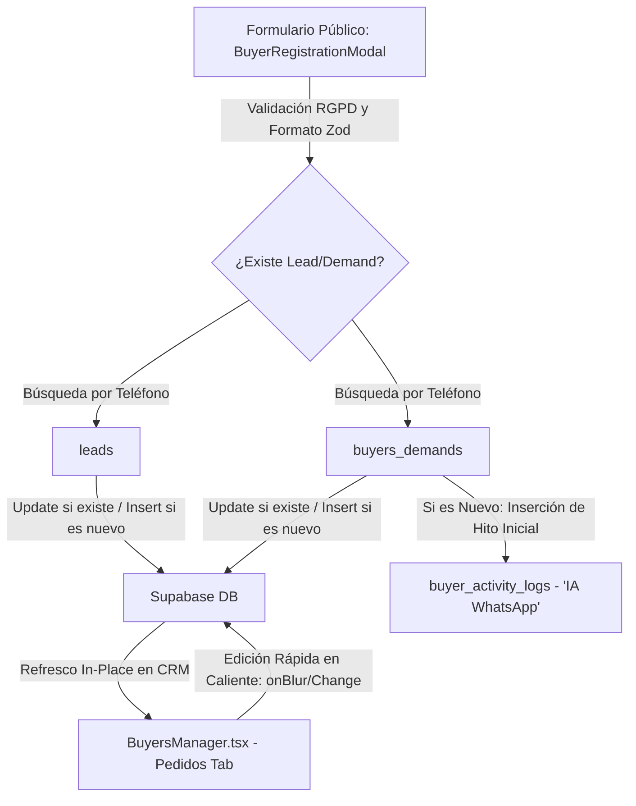

# 🏛️ MASTER ARCHITECTURE - Tu Asesor V2
*Archivo de referencia de la arquitectura global del proyecto "Tu Asesor", CRM Inmobiliario y Portal Web Público.*

---

## 📌 1. Arquitectura de Flujo de Datos y Sincronización
El sistema opera sobre una sincronización dual entre la navegación pública del usuario y el panel de administración privado (`/admin`).



### 🔁 Flujo de Deduplicación y Escritura Paralela
Cuando un comprador se registra de manera pública:
1. **Búsqueda por Teléfono:** Se realiza una consulta defensiva para comprobar si el número de teléfono (normalizado sin caracteres especiales) ya existe en las tablas `leads` y `buyers_demands`.
2. **Modo Upsert Seguro:** 
   - **Existente:** Se actualizan sus datos personales (nombre, email), presupuesto máximo, requerimientos de habitaciones/baños, tipo de propiedad, método de pago y las zonas preferenciales detectadas, registrando la fecha de última actividad (`last_activity_at`).
   - **Nuevo:** Se crea de cero en ambas tablas (inicializando `min_budget = 0`, `min_sqm = 0` y `status = "Búsqueda activa"`).
3. **Registro en el Timeline:** Si es un registro nuevo, se inyecta de forma paralela un hito inicial en `buyer_activity_logs` con `event_type = 'IA WhatsApp'`, titulado `'Registro público online'` y detallando en las notas las zonas geográficas que la IA y el mapa han mapeado.

---

## 🗺️ 2. Motor de Mapeo Espacial y Mapeo de Zonas (Sevilla)
La aplicación integra un sistema avanzado de geolocalización que traduce los gestos interactivos en el mapa (polígonos dibujados por el usuario) y búsquedas por texto a zonas y barrios estructurados de Sevilla y el Aljarafe.

```
Zonas de Sevilla Capital (15) y Aljarafe/Pueblos (15)
                   │
         ┌─────────┴─────────┐
         ▼                   ▼
   [Dibujo en Mapa]    [Búsqueda Texto]
         │                   │
         ▼                   ▼
  Ray-Casting Alg.     Normalización String
 (Point-in-Polygon)   (Sin acentos, lowercase)
         │                   │
         ├───────────────────┘
         ▼
[preferred_zones: text[]]
```

### 📐 A. Algoritmo de Mapeo por Polígonos (Ray-Casting & Euclidean Fallback)
1. **Centroides de Zonas:** Declaramos un set de 30 coordenadas fijas que representan el centro de gravedad (centroide) de cada barrio oficial de Sevilla Capital (ej. Triana, Nervión, Los Remedios) y localidades del Aljarafe/Provincia (ej. Tomares, Mairena del Aljarafe, Dos Hermanas).
2. **Ray Casting Point-in-Polygon:** Al recibir el array de vértices de los polígonos dibujados en la interfaz de Leaflet por el usuario, el algoritmo comprueba qué centroides de barrios caen físicamente dentro del polígono.
   - Si la prueba es afirmativa, el barrio es añadido automáticamente al array `preferred_zones`.
3. **Proximidad Euclidiana (Fallback):** En caso de que el usuario dibuje un polígono muy pequeño o entre zonas y ningún centroide caiga estrictamente dentro de él:
   - Se calcula la distancia euclidiana mínima entre el centroide del polígono dibujado y todos los centroides oficiales.
   - Se asocia el barrio más cercano con un umbral máximo de seguridad de `0.05` grados (aproximadamente **5 km**).

### 📝 B. Algoritmo de Mapeo por Texto
1. Se toma el texto escrito por el usuario en el campo de ubicación.
2. Se somete a una función de normalización que elimina tildes y diéresis, convierte el texto a minúsculas y elimina espacios extras.
3. Se realiza una comparación de inclusión parcial contra los nombres de las 30 zonas oficiales de Sevilla y el Aljarafe, mapeando con precisión los aciertos a la base de datos de manera normalizada.

---

## 🛡️ 3. Modelo de Seguridad y RLS en Supabase
El backend de base de datos se rige por políticas de seguridad de Row-Level Security (RLS) estrictas para garantizar la protección de datos personales de carácter sensible (PII).

* **Políticas de Inserción Públicas:** Las tablas `leads` y `tool_calculations` cuentan con RLS que validan el formato de datos del lado del servidor:
  - Longitud de nombres (`name` entre 2 y 100 caracteres).
  - Patrón de teléfonos (`phone` coincidente con regex de 9 a 15 dígitos).
  - Integridad en estados por defecto (`status = 'new'`).
* **Protección Contra Fugas de PII (Smart Matchmaker):** Para evitar el over-fetching de leads de compradores en el navegador, se propuso la migración del algoritmo de coincidencia geográfica (Haversine y cálculo de polígono) a una **Función RPC en PostgreSQL** (`get_matching_leads_for_property`).
  - Esto ejecuta los cálculos del lado del servidor.
  - Revoca el acceso público (sólo accesible a roles `authenticated` o `service_role`).
  - Retorna únicamente las coincidencias exactas filtradas en la base de datos.

---

## 💎 4. Estética de Diseño y Experiencia de Usuario (UI/UX)
El ecosistema visual del proyecto implementa una estética **Premium Dark Glassmorphism** inmersiva.

* **Paleta de Colores Corporativa:**
  - Fondo Global: `#0f172a` (Azul Pizarra Oscuro).
  - Fondo de Paneles/Tarjetas: `#1E293B` con opacidad controlada (`bg-[#1E293B]/70` o `bg-white/5`).
  - Acentos y Detalles de Resalte: `#FBBF24` (Amarillo Ámbar / Dorado Premium).
  - Estado Positivo/WhatsApp Directo: `#25D366` (Verde WhatsApp Vibrante).
* **Efectos Visuales Glassmorphic:**
  - Utilización obligatoria de filtros de desenfoque de fondo: `backdrop-blur-md` o `backdrop-blur-xl`.
  - Bordes semitransparentes delgados y de bajo contraste: `border border-white/5` o `border-white/10`.
  - Sombras de resplandor sutiles en hover para elementos interactivos en color ámbar.
* **Refinamientos del Panel CRM (BuyersManager):**
  - **Edición en Caliente:** El Drawer de perfil de comprador en CRM permite la edición rápida interactiva en caliente. Al interactuar con presupuestos, habitaciones, baños, tipo de propiedad o eliminar/agregar zonas geográficas, los cambios se inyectan inmediatamente en la base de datos vía Supabase en la interacción (`onBlur` o tecla `Enter`), con estados visuales activos.
  - **Consola Financiera Dinámica:** El Drawer realiza cálculos automáticos del capital hipotecario necesario y los ahorros reactivamente según la forma de pago elegida (Hipoteca con estudio, Preconcedida, Al contado).

---

## 🤖 5. Estructura y Canales de Sincronización del Equipo de IA
El desarrollo del proyecto está coordinado de forma asíncrona mediante buzones de sincronización en `docs/sync/`:
* `MASTER_ARCHITECTURE.md` (Este documento): Eje central de decisiones de arquitectura.
* `SYNC_WEB.md`: Coordinación de integraciones front-end y diseño visual público.
* `SYNC_CRM.md`: Coordinación del panel privado de administración y KPIs.
* `SYNC_AI.md`: Flujos de automatización, WhatsApp y configuraciones del chatbot Paula.
* `SYNC_SUPERVISOR.md`: Auditoría de código, mitigación de fallos, tipado e higiene técnica general.
